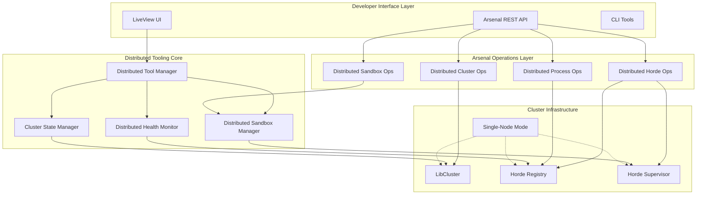

# Design Document

## Overview

This design outlines a comprehensive distributed development tooling system built on top of the existing Arsenal metaprogramming framework. The system provides essential tools for developing, debugging, and monitoring distributed OTP applications using LibCluster and Horde, with a focus on developer productivity and minimal complexity exposure.

The key insight is leveraging Arsenal's automatic API generation to rapidly build distributed debugging tools, creating a self-reinforcing development experience where the platform dogfoods itself.

## Architecture

### High-Level Architecture



### Component Interaction Flow

1. **Developer Request** → LiveView UI or Arsenal API
2. **Request Routing** → Arsenal Plug automatically routes to appropriate operation
3. **Operation Execution** → Distributed operation executes across cluster
4. **State Management** → Cluster State Manager maintains real-time state
5. **Response Formatting** → Arsenal automatically formats and returns response

## Components and Interfaces

### 1. Distributed Tool Manager (DTM)

**Purpose**: Central coordinator for all distributed development tools

**Location**: `lib/otp_supervisor/distributed/tool_manager.ex`

**Key Responsibilities**:
- Coordinate between different distributed tooling components
- Manage single-node vs multi-node mode switching
- Provide unified interface for tool configuration
- Handle tool lifecycle and health monitoring

**Interface**:
```elixir
defmodule OTPSupervisor.Distributed.ToolManager do
  use GenServer

  # Public API
  def start_link(opts \\ [])
  def set_mode(:single_node | :multi_node)
  def get_mode()
  def get_cluster_status()
  def register_tool(tool_module, opts \\ [])
  def unregister_tool(tool_module)
  def list_active_tools()
end
```

### 2. Cluster State Manager (CSM)

**Purpose**: Real-time cluster topology and state management

**Location**: `lib/otp_supervisor/distributed/cluster_state_manager.ex`

**Key Responsibilities**:
- Track cluster membership changes in real-time
- Maintain process distribution mapping
- Provide cluster topology visualization data
- Handle network partition detection and recovery

**Interface**:
```elixir
defmodule OTPSupervisor.Distributed.ClusterStateManager do
  use GenServer

  # Public API
  def start_link(opts \\ [])
  def get_cluster_topology()
  def get_node_info(node)
  def get_process_distribution()
  def subscribe_to_changes()
  def get_partition_status()
end
```

### 3. Distributed Health Monitor (DHM)

**Purpose**: Continuous monitoring of cluster health and performance

**Location**: `lib/otp_supervisor/distributed/health_monitor.ex`

**Key Responsibilities**:
- Monitor node health and resource usage
- Detect and alert on cluster issues
- Track Horde distribution effectiveness
- Provide performance metrics for debugging tools

**Interface**:
```elixir
defmodule OTPSupervisor.Distributed.HealthMonitor do
  use GenServer

  # Public API
  def start_link(opts \\ [])
  def get_cluster_health()
  def get_node_health(node)
  def set_alert_thresholds(thresholds)
  def get_performance_metrics()
  def subscribe_to_alerts()
end
```

### 4. Single-Node Mode Simulator

**Purpose**: Simulate distributed behavior on a single node for development

**Location**: `lib/otp_supervisor/distributed/single_node_simulator.ex`

**Key Responsibilities**:
- Simulate multi-node cluster behavior locally
- Provide fake node topology for testing
- Intercept and simulate distributed operations
- Maintain compatibility with multi-node code

**Interface**:
```elixir
defmodule OTPSupervisor.Distributed.SingleNodeSimulator do
  use GenServer

  # Public API
  def start_link(opts \\ [])
  def enable_simulation(node_count \\ 3)
  def disable_simulation()
  def get_simulated_nodes()
  def simulate_node_failure(node)
  def simulate_network_partition(nodes)
end
```

### 5. Arsenal Distributed Operations

**Purpose**: Auto-generated REST API operations for distributed debugging

**Location**: `lib/otp_supervisor/core/arsenal/operations/distributed/`

**Operations to Implement**:

#### ClusterTopology Operation
```elixir
defmodule OTPSupervisor.Core.Arsenal.Operations.Distributed.ClusterTopology do
  use OTPSupervisor.Core.Arsenal.Operation

  def rest_config do
    %{
      method: :get,
      path: "/api/v1/cluster/topology",
      summary: "Get real-time cluster topology and node information"
    }
  end

  def execute(_params) do
    OTPSupervisor.Distributed.ClusterStateManager.get_cluster_topology()
  end
end
```

#### DistributedProcessList Operation
```elixir
defmodule OTPSupervisor.Core.Arsenal.Operations.Distributed.ProcessList do
  use OTPSupervisor.Core.Arsenal.Operation

  def rest_config do
    %{
      method: :get,
      path: "/api/v1/cluster/processes",
      summary: "List all processes across the cluster with node information",
      parameters: [
        %{name: :node, type: :string, required: false, location: :query},
        %{name: :type, type: :string, required: false, location: :query}
      ]
    }
  end

  def execute(params) do
    # Implementation handles cross-node process discovery
  end
end
```

#### HordeRegistryInspect Operation
```elixir
defmodule OTPSupervisor.Core.Arsenal.Operations.Distributed.HordeRegistry do
  use OTPSupervisor.Core.Arsenal.Operation

  def rest_config do
    %{
      method: :get,
      path: "/api/v1/horde/registry",
      summary: "Inspect Horde registry contents across cluster"
    }
  end

  def execute(_params) do
    # Implementation queries Horde registry across all nodes
  end
end
```

#### DistributedSandboxCreate Operation
```elixir
defmodule OTPSupervisor.Core.Arsenal.Operations.Distributed.SandboxCreate do
  use OTPSupervisor.Core.Arsenal.Operation

  def rest_config do
    %{
      method: :post,
      path: "/api/v1/cluster/sandboxes",
      summary: "Create a distributed sandbox spanning multiple nodes",
      parameters: [
        %{name: :nodes, type: :array, required: false, location: :body},
        %{name: :placement_strategy, type: :string, required: false, location: :body}
      ]
    }
  end

  def execute(params) do
    # Implementation creates sandbox across specified nodes
  end
end
```

### 6. LiveView Distributed Dashboard

**Purpose**: Real-time web interface for distributed system monitoring

**Location**: `lib/otp_supervisor_web/live/distributed_dashboard_live.ex`

**Key Features**:
- Real-time cluster topology visualization
- Node health and resource monitoring
- Process distribution heat maps
- Interactive debugging controls
- Single-node mode toggle

**Interface Components**:
```elixir
defmodule OTPSupervisorWeb.Live.DistributedDashboardLive do
  use Phoenix.LiveView

  # Main dashboard with cluster overview
  def render(assigns)
  def mount(_params, _session, socket)
  def handle_info({:cluster_change, _event}, socket)
  def handle_event("toggle_mode", _params, socket)
  def handle_event("inspect_node", %{"node" => node}, socket)
end
```

## Data Models

### Cluster Topology Model
```elixir
defmodule OTPSupervisor.Distributed.Models.ClusterTopology do
  defstruct [
    :nodes,           # List of node information
    :connections,     # Node connection graph
    :partitions,      # Network partition information
    :updated_at       # Last update timestamp
  ]
end
```

### Node Information Model
```elixir
defmodule OTPSupervisor.Distributed.Models.NodeInfo do
  defstruct [
    :name,            # Node name
    :status,          # :up, :down, :partitioned
    :health,          # Health metrics
    :processes,       # Process count and distribution
    :resources,       # CPU, memory, etc.
    :horde_members    # Horde membership status
  ]
end
```

### Distributed Process Model
```elixir
defmodule OTPSupervisor.Distributed.Models.DistributedProcess do
  defstruct [
    :pid,             # Process ID
    :node,            # Node where process is running
    :name,            # Registered name if any
    :type,            # Process type
    :horde_registered,# Whether registered in Horde
    :supervisor,      # Supervising process info
    :health           # Process health metrics
  ]
end
```

## Error Handling

### Distributed Operation Error Handling

**Network Partition Handling**:
```elixir
defmodule OTPSupervisor.Distributed.ErrorHandling do
  def handle_network_partition(operation, nodes) do
    case detect_partition_type(nodes) do
      :minority_partition ->
        {:error, :minority_partition, "Operation blocked in minority partition"}
      
      :majority_partition ->
        execute_with_majority(operation, nodes)
      
      :split_brain ->
        {:error, :split_brain, "Cannot execute during split-brain scenario"}
    end
  end
end
```

**Node Failure Recovery**:
```elixir
def handle_node_failure(operation, failed_node) do
  case operation.requires_all_nodes do
    true ->
      {:error, :node_required, "Operation requires all nodes to be available"}
    
    false ->
      execute_with_remaining_nodes(operation, available_nodes())
  end
end
```

**Arsenal Operation Error Wrapping**:
All distributed operations automatically get enhanced error handling through Arsenal's metaprogramming:

```elixir
defp execute_distributed_operation(operation_module, params) do
  try do
    operation_module.execute(params)
  rescue
    error -> 
      enhanced_error = enhance_distributed_error(error, params)
      {:error, enhanced_error}
  catch
    :exit, reason ->
      case reason do
        {:nodedown, node} -> {:error, {:node_unavailable, node}}
        {:timeout, _} -> {:error, :distributed_timeout}
        _ -> {:error, {:distributed_exit, reason}}
      end
  end
end
```

## Testing Strategy

### Unit Testing Strategy

**Component Testing**:
- Each distributed component has comprehensive unit tests
- Mock cluster states for testing different scenarios
- Test single-node mode simulation accuracy
- Validate Arsenal operation contracts

**Arsenal Operation Testing**:
```elixir
defmodule OTPSupervisor.Core.Arsenal.Operations.Distributed.ClusterTopologyTest do
  use ExUnit.Case

  test "returns cluster topology in correct format" do
    # Mock cluster state
    # Execute operation
    # Validate response structure
  end

  test "handles node failures gracefully" do
    # Simulate node failure
    # Execute operation
    # Validate error handling
  end
end
```

### Integration Testing Strategy

**Multi-Node Testing**:
- Automated tests using multiple BEAM nodes
- Test actual LibCluster and Horde integration
- Validate cross-node operation execution
- Test network partition scenarios

**Single-Node Mode Testing**:
- Verify single-node mode provides equivalent functionality
- Test mode switching without data loss
- Validate simulation accuracy

### Performance Testing Strategy

**Load Testing**:
- Test distributed operations under high load
- Measure performance impact of monitoring
- Validate resource usage stays within limits
- Test scaling characteristics

**Latency Testing**:
- Measure cross-node operation latency
- Test timeout handling
- Validate performance requirements

## Implementation Phases

### Phase 1: Foundation (Week 1)
- Implement Distributed Tool Manager
- Create basic Cluster State Manager
- Set up Arsenal operation registry for distributed ops
- Implement single-node mode simulator

### Phase 2: Core Operations (Week 2)
- Implement distributed Arsenal operations
- Create cluster topology visualization
- Add basic health monitoring
- Integrate with existing Arsenal framework

### Phase 3: Advanced Features (Week 3)
- Implement distributed sandbox management
- Add comprehensive health monitoring
- Create LiveView distributed dashboard
- Add performance monitoring

### Phase 4: Polish and Integration (Week 4)
- Comprehensive testing and bug fixes
- Performance optimization
- Documentation and examples
- Integration with existing development workflow

## Success Metrics

1. **Development Velocity**: 50% reduction in time to debug distributed issues
2. **Tool Adoption**: All distributed operations available via Arsenal API
3. **Performance Impact**: <10ms latency overhead for distributed operations
4. **Reliability**: 99.9% uptime for debugging tools during cluster changes
5. **Usability**: Single-node mode provides 95% feature parity with multi-node
6. **Coverage**: 100% of distributed debugging scenarios supported

## Future Enhancements

1. **Advanced Visualization**: 3D cluster topology visualization
2. **Predictive Monitoring**: ML-based anomaly detection
3. **Automated Remediation**: Self-healing cluster management
4. **Performance Profiling**: Distributed flame graphs
5. **Chaos Engineering**: Built-in chaos testing tools
6. **Multi-Cluster Support**: Cross-cluster debugging capabilities