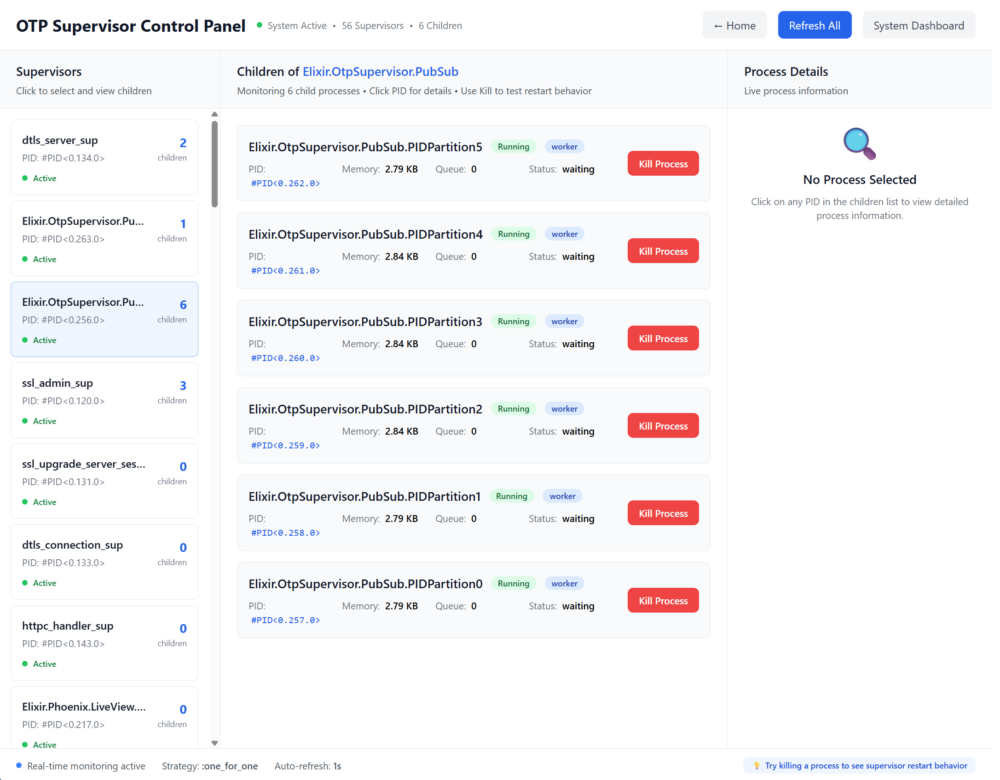
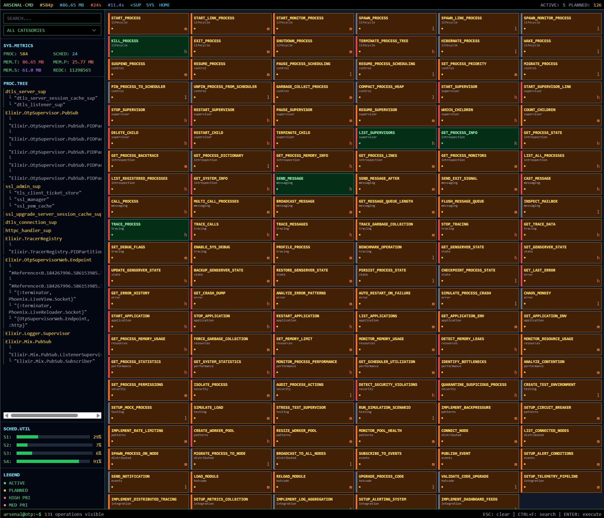

# OTP Supervisor Educational Platform

A comprehensive, production-grade educational platform for learning OTP (Open Telecom Platform) supervision concepts through hands-on experimentation and real-time visualization.

## Overview

This project provides an advanced learning environment for OTP concepts, combining theoretical knowledge with practical implementation. Built with Phoenix LiveView, it offers:





- **🔬 Interactive Sandbox Environments** - Isolated experimentation without system risk
- **📊 Real-time Analytics** - Production-grade telemetry and monitoring systems
- **🎯 Educational Focus** - Progressive complexity with comprehensive documentation
- **⚡ Live Visualization** - Dynamic supervision tree updates and process management
- **🛠️ Advanced Tooling** - Message tracing, process introspection, and system analysis
- **🏗️ Production Patterns** - Real-world OTP design patterns and best practices

## 🚀 Quick Start

```bash
mix setup                    # Install dependencies and setup database
mix phx.server              # Start server → http://localhost:4000
# OR
iex -S mix phx.server       # Start with interactive console
```

### Key Interfaces
- **`/supervisors`** - Interactive supervisor management dashboard
- **`/system`** - System-wide analytics and monitoring
- **`/api/v1/*`** - RESTful API for programmatic access

## 📋 Essential Commands

### Development & Testing
```bash
# Server Management
mix phx.server              # Start Phoenix server
iex -S mix phx.server       # Start with IEx console
mix test                    # Run comprehensive test suite
mix test --cover            # Run tests with coverage analysis

# Code Quality
mix format                  # Format code
mix compile --warnings-as-errors
mix dialyzer               # Static analysis (if configured)

# Database
mix ecto.setup             # Setup database
mix ecto.migrate           # Run migrations
```

### Interactive Console (IEx)
```elixir
# Supervisor Management
Control.list_supervisors()                    # List all supervisors
Control.get_supervision_tree(:demo_one_for_one) # Inspect hierarchy

# Process Management  
Control.list_all_processes()                  # System process overview
Control.kill_process(pid)                     # Safe process termination
Control.get_process_info(pid)                 # Process introspection

# Sandbox Operations
SandboxManager.create_sandbox("test", TestDemoSupervisor)
SandboxManager.list_sandboxes()               # Active sandboxes
SandboxManager.destroy_sandbox("test")        # Cleanup

# Analytics
AnalyticsServer.get_restart_history(sup_pid)  # Restart analytics
AnalyticsServer.get_failure_rate(sup_pid)     # Failure rate analysis

# Message Tracing
MessageTracer.trace_messages(pid)             # Start tracing
MessageTracer.get_message_history(pid)        # Retrieve messages
MessageTracer.stop_tracing(pid)               # Stop tracing
```

## 🏗️ Architecture

### System Overview
```
OtpSupervisor.Application (Root Supervisor)
├── OtpSupervisorWeb.Telemetry        # Web metrics and monitoring
├── Phoenix.PubSub                    # Real-time communication
├── Registry (TracerRegistry)         # Message tracer management
├── AnalyticsServer                   # Supervisor monitoring system
├── SandboxManager                    # Isolated testing environments
├── OtpSupervisorWeb.Endpoint        # Phoenix web endpoint
└── DemoSupervisor                    # Educational examples
```

### Core Components

#### 1. Control Module (`lib/otp_supervisor/core/control.ex`)
**Central API hub** providing comprehensive OTP process management:

**Key Capabilities:**
- **Process Discovery**: List and classify all system processes
- **Supervisor Management**: Deep inspection of supervision hierarchies  
- **Safe Termination**: Controlled process killing with proper cleanup
- **System Analysis**: Process topology mapping and relationship analysis
- **Educational Tools**: Functions designed for learning OTP patterns

**API Highlights:**
```elixir
# Process Management
Control.list_supervisors()              # All supervisors with metadata
Control.get_supervision_tree(sup)       # Complete hierarchy inspection
Control.kill_process(pid)               # Safe process termination
Control.get_process_info(pid)           # Comprehensive process details

# System Analysis  
Control.list_all_processes()            # System-wide process overview
Control.build_process_graph()           # Visual topology mapping
Control.get_process_state(pid)          # GenServer state inspection
Control.detect_system_anomalies()       # Automated health analysis
```

#### 2. Analytics Server (`lib/otp_supervisor/core/analytics_server.ex`)
**Production-grade monitoring system** for supervisor behavior analysis:

**Implementation Details:**
- **Process Monitoring Approach**: Uses PID change detection for restart tracking
- **Bounded Storage**: Maintains last 1000 events per supervisor
- **Real-time Analytics**: Failure rates, trend analysis, and health metrics
- **Zero External Dependencies**: Pure OTP implementation

**Key Features:**
```elixir
# Supervisor Registration & Monitoring
AnalyticsServer.register_supervisor(pid, name)
AnalyticsServer.establish_baseline(pid)

# Analytics & Reporting
AnalyticsServer.get_restart_history(pid)         # Historical restart data
AnalyticsServer.get_failure_rate(pid, window)    # Time-windowed analysis
AnalyticsServer.get_all_supervisor_stats()       # System-wide statistics

# Synchronization (for testing)
AnalyticsServer.sync(pid)                        # Force immediate scan
```

#### 3. Sandbox Manager (`lib/otp_supervisor/core/sandbox_manager.ex`)
**Isolated experimentation platform** for safe OTP learning:

**Production Patterns:**
- **Dynamic Supervisor Creation**: Unique naming and resource isolation
- **ETS-based Fast Lookup**: O(1) sandbox metadata access
- **Automatic Cleanup**: Process monitoring with graceful shutdown
- **Resource Management**: Proper supervisor lifecycle with unlinking

**Sandbox Operations:**
```elixir
# Sandbox Lifecycle
SandboxManager.create_sandbox(id, module, opts)  # Create isolated environment
SandboxManager.restart_sandbox(id)               # Full restart with config preservation
SandboxManager.destroy_sandbox(id)               # Graceful cleanup

# Introspection
SandboxManager.list_sandboxes()                  # All active sandboxes
SandboxManager.get_sandbox_info(id)              # Detailed sandbox metadata
SandboxManager.get_sandbox_pid(id)               # Direct PID access
```

#### 4. Message Tracer (`lib/otp_supervisor/core/message_tracer.ex`)
**Advanced debugging system** for OTP message flow analysis:

**Technical Implementation:**
- **Erlang Trace Integration**: Low-overhead system tracing
- **Registry-based Management**: Automatic tracer cleanup
- **Pattern Analysis**: Message flow statistics and debugging insights
- **Educational Focus**: Demonstrates proper OTP debugging techniques

**Tracing Operations:**
```elixir
# Message Tracing
MessageTracer.trace_messages(pid, opts)          # Start comprehensive tracing
MessageTracer.get_message_history(pid)           # Retrieve captured messages
MessageTracer.analyze_message_patterns(msgs)     # Pattern analysis
MessageTracer.stop_tracing(pid)                  # Clean shutdown
```

## 📁 Project Structure

```
lib/
├── otp_supervisor.ex                    # Main application module
├── otp_supervisor/
│   ├── application.ex                   # OTP application & supervision tree
│   ├── core/                           # Core OTP functionality
│   │   ├── control.ex                  # Central process management API
│   │   ├── analytics_server.ex         # Production-grade monitoring
│   │   ├── sandbox_manager.ex          # Isolated testing environments
│   │   └── message_tracer.ex           # Advanced debugging tools
│   └── sandbox/                        # Educational examples
│       ├── supervisors/
│       │   └── demo_supervisor.ex      # Main educational supervisor
│       ├── test_demo_supervisor.ex     # Isolated testing supervisor
│       └── workers/                    # Example worker processes
│           ├── counter.ex              # Stateful GenServer example
│           └── printer.ex              # Message processing example
├── otp_supervisor_web.ex               # Phoenix web module
└── otp_supervisor_web/                 # Web interface
    ├── components/                     # Reusable LiveView components
    ├── controllers/api/v1/             # RESTful API endpoints
    ├── live/                          # LiveView interfaces
    │   ├── supervisor_live.ex         # Supervisor management dashboard
    │   └── system_dashboard_live.ex   # System-wide monitoring
    └── telemetry.ex                   # Web telemetry configuration
```

### Test Architecture
```
test/
├── otp_supervisor/
│   ├── core/                          # Core functionality tests
│   │   ├── control_test.exs           # Process management API
│   │   ├── analytics_server_test.exs  # Real monitoring system tests
│   │   ├── sandbox_manager_test.exs   # Sandbox isolation tests
│   │   └── message_tracer_test.exs    # Tracing functionality
│   └── sandbox/                       # Worker behavior tests
│       ├── test_demo_supervisor_test.exs
│       └── workers/
├── otp_supervisor_web/                # Web interface tests
│   ├── live/                         # LiveView integration tests
│   └── controllers/api/v1/           # API endpoint tests
└── support/
    └── supervisor_test_helper.ex      # Advanced test utilities
```

## 🎯 Educational Features

### 1. Progressive Learning Path
The platform is designed for step-by-step OTP mastery:

1. **Basic Concepts**: Start with supervision tree visualization
2. **Process Lifecycle**: Experiment with process killing and restart behavior  
3. **Advanced Patterns**: Explore different supervision strategies
4. **Debugging Techniques**: Use message tracing for system analysis
5. **Production Practices**: Study real-world implementation patterns

### 2. Supervision Strategies Demonstrated
**One-for-One Strategy** (`:one_for_one`):
- Failed child restarted individually
- Other children unaffected
- Most common production pattern

**One-for-All Strategy** (`:one_for_all`):
- All children restarted when one fails  
- Used when children are interdependent
- Ensures consistent system state

**Rest-for-One Strategy** (`:rest_for_one`):
- Failed child and subsequent children restarted
- Maintains startup order dependencies
- Useful for pipeline architectures

### 3. Interactive Learning Tools

**Sandbox Environments:**
- Isolated testing without system impact
- Concurrent experiment support
- Automatic resource cleanup
- Configuration preservation across restarts

**Real-time Visualization:**
- Dynamic supervision tree updates
- Process state change monitoring
- Interactive process management
- Live system health metrics

**Advanced Analytics:**
- Restart pattern analysis
- Failure rate calculations
- System anomaly detection
- Performance trend monitoring

## 🌐 Web Interface

### Supervisor Dashboard (`/supervisors`)
**Interactive supervisor management interface:**
- Real-time supervision tree visualization
- Process killing with immediate feedback
- Live restart counter updates
- Process detail inspection
- Bulk operations support

### System Dashboard (`/system`)
**System-wide monitoring and analytics:**
- Process count and health metrics
- Anomaly detection alerts
- System topology visualization
- Performance analytics
- Export capabilities (JSON/CSV)

### API Endpoints (`/api/v1/`)
**Comprehensive RESTful API:**

#### Process Management (`/api/v1/processes`)
```bash
# Process Listing & Details
GET    /api/v1/processes                    # List all processes (with pagination & filtering)
GET    /api/v1/processes/:pid               # Get detailed process information
GET    /api/v1/processes/:pid/state         # Get GenServer internal state

# Message Tracing
GET    /api/v1/processes/:pid/messages      # Get captured message history
POST   /api/v1/processes/:pid/trace         # Start message tracing
DELETE /api/v1/processes/:pid/trace         # Stop message tracing

# Process Communication
POST   /api/v1/processes/:pid/message       # Send message to process (cast/call/send)
```

#### Supervisor Management (`/api/v1/supervisors`)
```bash
# Supervisor Operations
GET    /api/v1/supervisors                  # List all supervisors
GET    /api/v1/supervisors/:name            # Get supervisor details & children
GET    /api/v1/supervisors/:name/analytics  # Get supervisor performance metrics

# Supervisor Configuration
POST   /api/v1/supervisors/:name/strategy   # Change supervision strategy
POST   /api/v1/supervisors/:name/simulate   # Simulate failures (child/supervisor)
```

#### System Analysis (`/api/v1/system`)
```bash
# System Health
GET    /api/v1/system/health                # System health metrics & status
GET    /api/v1/system/graph                 # Process relationship graph
GET    /api/v1/system/bottlenecks           # Identify system bottlenecks
GET    /api/v1/system/anomalies             # Detect system anomalies
```

## 🧪 Testing & Quality

### Comprehensive Test Coverage
The project maintains **production-grade test coverage** with multiple testing strategies:

**Test Categories:**
- **Unit Tests**: Individual module functionality
- **Integration Tests**: Cross-module interaction
- **LiveView Tests**: Web interface behavior
- **Property Tests**: Edge case validation
- **Performance Tests**: System scalability

**Advanced Test Patterns:**
```elixir
# Proper OTP Synchronization (no Process.sleep)
test "supervisor restart behavior" do
  pid = start_supervised_child()
  ref = Process.monitor(pid)
  Process.exit(pid, :kill)
  
  # Wait for actual termination
  receive do
    {:DOWN, ^ref, :process, ^pid, _} -> :ok
  after 1000 -> flunk("Process did not terminate")
  end
  
  # Verify restart occurred
  assert Process.whereis(:child) != pid
end
```

### Test Infrastructure Highlights
- **Zero Sleep Dependencies**: Uses proper OTP synchronization
- **Sandbox Isolation**: Prevents test interference
- **Resource Cleanup**: Automatic test environment reset
- **Educational Value**: Tests demonstrate OTP best practices

```bash
# Test Execution
mix test                            # Full test suite
mix test --cover                    # Coverage analysis
mix test test/path/specific_test.exs # Individual test files
mix test --trace                    # Detailed test output
```

## 🔧 Advanced Configuration

### Analytics Configuration
```elixir
# config/config.exs
config :otp_supervisor, OTPSupervisor.Core.AnalyticsServer,
  scan_interval: 2000,              # Supervisor scan frequency
  max_events_per_supervisor: 1000,  # Event history limit
  enable_detailed_logging: true     # Debug information
```

### Sandbox Configuration  
```elixir
# Sandbox creation with custom options
SandboxManager.create_sandbox("test", TestDemoSupervisor,
  strategy: :one_for_all,           # Supervision strategy
  max_restarts: 5,                  # Restart intensity
  max_seconds: 60,                  # Restart period
  custom_config: %{key: "value"}    # Application-specific config
)
```

### Message Tracing Configuration
```elixir
# Advanced tracing options
MessageTracer.trace_messages(pid,
  message_limit: 1000,              # Maximum captured messages
  pattern_matching: true,           # Enable pattern analysis
  include_system_messages: false,   # Filter system messages
  auto_cleanup: true                # Automatic cleanup on process death
)
```

## 🎓 Learning Resources

### OTP Concepts Demonstrated
- **Supervision Trees**: Hierarchical fault tolerance
- **Let-It-Crash Philosophy**: Embracing failure for robustness
- **Process Linking vs Monitoring**: Bidirectional vs unidirectional coupling
- **GenServer Patterns**: Stateful server process implementation
- **Registry Usage**: Process discovery and naming strategies
- **Application Architecture**: Proper OTP application structure

### Production Patterns Illustrated
- **Graceful Degradation**: System behavior under failure
- **Resource Management**: Bounded data structures and cleanup
- **Performance Monitoring**: Low-overhead system introspection
- **Fault Isolation**: Preventing cascade failures
- **Configuration Management**: Runtime reconfiguration patterns

### Recommended Learning Sequence
1. **Foundation**: Explore supervision tree visualization
2. **Experimentation**: Kill processes and observe restart behavior
3. **Analysis**: Use message tracing to understand communication
4. **Implementation**: Study source code for pattern understanding
5. **Practice**: Create custom supervisors using learned patterns
6. **Mastery**: Implement production-grade OTP applications

## 📊 Performance & Production Readiness

### Performance Characteristics
- **Minimal Overhead**: Analytics system designed for production use
- **Bounded Resources**: Automatic cleanup prevents memory leaks
- **Efficient Monitoring**: O(1) lookups with ETS tables
- **Scalable Architecture**: Handles large supervision trees

### Production Features
- **Comprehensive Error Handling**: Graceful degradation under all conditions
- **Resource Cleanup**: Automatic management of system resources
- **Configuration Hot-Reload**: Runtime configuration updates
- **Monitoring Integration**: Built-in metrics and health checks

## 🤝 Development & Contributing

### Prerequisites
- **Elixir**: 1.14+ (OTP 24+)
- **Phoenix**: 1.7+
- **PostgreSQL**: For session storage and development
- **Node.js**: For asset compilation

### Development Setup
```bash
git clone <repository>
cd otp_supervisor
mix deps.get                        # Install Elixir dependencies
mix ecto.setup                      # Setup database
npm install --prefix assets         # Install Node.js dependencies
mix phx.server                      # Start development server
```

### Code Quality Standards
- **Documentation**: Comprehensive module and function documentation
- **Testing**: All new features require test coverage
- **Performance**: Consider performance impact of new features
- **Educational Value**: Code should demonstrate OTP best practices

### Contributing Guidelines
1. **Fork & Branch**: Create feature branches from main
2. **Test Coverage**: Ensure all new code has corresponding tests
3. **Documentation**: Update README and module docs as needed
4. **Code Review**: Submit pull requests for review
5. **Educational Focus**: Maintain the platform's learning objectives

This platform represents a sophisticated, production-ready educational tool for mastering OTP supervision concepts through hands-on experimentation and real-world pattern implementation.