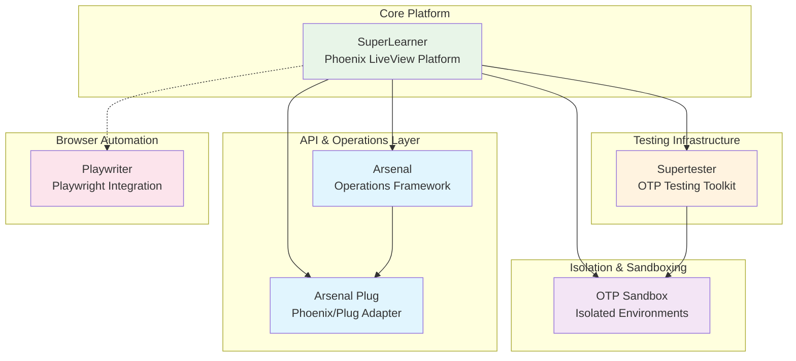
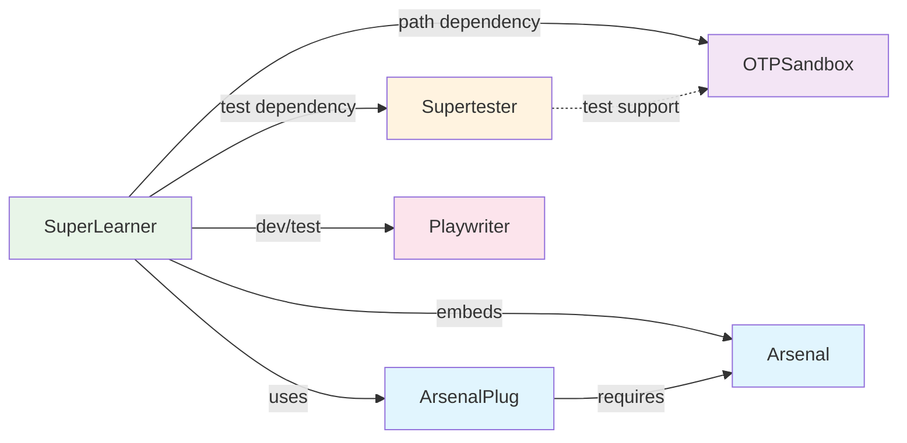

# SuperLearner Ecosystem Overview

**Document Version:** 1.0
**Date:** 2025-10-07
**Status:** Design Phase

## Executive Summary

The SuperLearner ecosystem is a comprehensive, production-grade educational platform for learning OTP (Open Telecom Platform) concepts through hands-on experimentation. It consists of **six specialized libraries** that work together to provide an integrated learning, testing, monitoring, and automation environment.

## Ecosystem Architecture

## Library Inventory

### 1. SuperLearner (Core Platform)
**Location:** `/home/home/p/g/n/superlearner`
**Type:** Phoenix LiveView Application
**Status:** ✅ Production-ready

**Purpose:** Central educational platform providing interactive OTP learning experiences

**Key Features:**
- Interactive supervisor management dashboard
- Real-time system monitoring and analytics
- Distributed cluster support (LibCluster, Horde)
- LiveView-based real-time visualization
- RESTful API for programmatic access
- Sandbox management for safe experimentation
- Message tracing and process introspection
- Educational documentation and resources

**Core Components:**
- `OTPSupervisor.Core.Control` - Central process management API
- `OTPSupervisor.Core.AnalyticsServer` - Supervisor monitoring
- `OTPSupervisor.Core.SandboxManager` - Isolated testing environments
- `OTPSupervisor.Core.MessageTracer` - Advanced debugging
- `OTPSupervisor.Distributed.*` - Cluster management tooling

---

### 2. Supertester (Testing Toolkit)
**Location:** `/home/home/p/g/n/supertester`
**Type:** Elixir Testing Library
**Status:** ✅ Hex package ready

**Purpose:** Battle-hardened testing toolkit for robust OTP application testing

**Key Features:**
- Rock-solid test isolation with `async: true` support
- Deterministic synchronization (replaces `Process.sleep/1`)
- OTP-aware assertions for GenServers and supervisors
- Effortless setup/teardown with automatic cleanup
- Resilience and chaos testing tools
- Process restart detection and verification

**Core Modules:**
- `Supertester.OTPHelpers` - Isolated process setup
- `Supertester.GenServerHelpers` - GenServer testing utilities
- `Supertester.Assertions` - OTP-specific assertions
- `Supertester.UnifiedTestFoundation` - Advanced isolation

**Integration Points:**
- Used throughout SuperLearner test suite
- Provides testing infrastructure for OTP Sandbox
- Enables reliable distributed testing

---

### 3. Arsenal (Operations Framework)
**Location:** `/home/home/p/g/n/arsenal`
**Type:** Metaprogramming Framework
**Status:** ✅ Core library ready

**Purpose:** Transform OTP operations into REST API endpoints through metaprogramming

**Key Features:**
- Automatic REST API generation from operation modules
- Operation registry with discovery and validation
- Parameter validation with custom validators
- OpenAPI documentation generation
- Framework-agnostic adapter design
- Built-in analytics and monitoring via `AnalyticsServer`
- Telemetry integration for all operations

**Core Components:**
- `Arsenal.Operation` - Operation behavior contract
- `Arsenal.Registry` - Central operation lifecycle manager
- `Arsenal.Adapter` - Framework-agnostic adapter behavior
- `Arsenal.AnalyticsServer` - Production monitoring

**Operation Categories:**
- Process Management (list, inspect, kill, trace)
- Supervisor Operations (list, analyze, configure)
- Distributed Operations (cluster health, topology, nodes)
- Sandbox Operations (create, restart, destroy, hot-reload)
- Storage Operations (trace session storage)

---

### 4. Arsenal Plug (Phoenix Adapter)
**Location:** `/home/home/p/g/n/arsenal_plug`
**Type:** Phoenix/Plug Integration Library
**Status:** ✅ Adapter ready

**Purpose:** Phoenix/Plug adapter for Arsenal operations - converts operations to HTTP endpoints

**Key Features:**
- Automatic REST API generation from Arsenal operations
- Dynamic operation discovery and routing
- Request parameter validation and transformation
- HTTP-appropriate error handling
- OpenAPI integration endpoints
- URL-safe parameter encoding (PIDs, etc.)
- JSON serialization

**Integration:**
- Plugs into Phoenix router as middleware
- Provides `ArsenalPlug.ArsenalController` for routing
- Extracts params from path, query, and body
- Formats responses as JSON

**Key Endpoints:**
- `GET /api/v1/arsenal/docs` - OpenAPI specification
- `GET /api/v1/arsenal/operations` - List operations
- `/*path` - Dynamic operation routing

---

### 5. OTP Sandbox (Isolation Framework)
**Location:** `/home/home/p/g/n/superlearner/sandbox/examples/otp_sandbox`
**Type:** Process Isolation Library
**Status:** ⚠️ Minimal documentation, needs expansion

**Purpose:** Isolated OTP experimentation environments (currently minimal)

**Current State:**
- Basic project structure
- Minimal README (placeholder)
- Integrated into SuperLearner as path dependency
- Functionality appears to be embedded in SuperLearner's `SandboxManager`

**Expected Features (Based on SuperLearner Integration):**
- Dynamic supervisor creation with unique naming
- ETS-based fast lookup for sandbox metadata
- Automatic cleanup and resource management
- Configuration preservation across restarts
- Process monitoring with graceful shutdown

**Integration Needs:**
- Extract sandbox functionality from SuperLearner
- Document public API
- Create standalone examples
- Publish as independent library

---

### 6. Playwriter (Browser Automation)
**Location:** `/home/home/p/g/n/playwriter`
**Type:** Browser Automation Library
**Status:** ✅ Hex package ready

**Purpose:** Cross-platform browser automation with WSL-to-Windows integration

**Key Features:**
- Full Playwright API access through composable design
- Windows browser integration via WebSocket
- Chrome profile support and management
- Headed/headless mode switching
- Cross-platform (Linux, macOS, Windows/WSL)
- Automatic cleanup and resource management
- Network discovery for WSL-Windows bridge

**Core Modules:**
- `Playwriter.CLI` - Command-line interface
- `Playwriter.Fetcher` - Core browser management
- `Playwriter.WindowsBrowserAdapter` - WSL-to-Windows integration
- `Playwriter.WindowsBrowserDirect` - Experimental alternatives

**Use Cases in SuperLearner:**
- UI testing and validation
- Screenshot generation for documentation
- Browser-based debugging interfaces
- Visual regression testing
- End-to-end workflow testing

---

## Dependency Graph

## Current Integration Status

### ✅ Fully Integrated
- **Arsenal → SuperLearner**: Arsenal operations embedded in `lib/otp_supervisor/core/arsenal/`
- **Arsenal Plug → SuperLearner**: Used for API routing (needs verification in router)
- **Supertester → SuperLearner**: Used throughout test suite

### ⚠️ Partially Integrated
- **OTP Sandbox → SuperLearner**: Path dependency exists, but functionality is in `SandboxManager`
- **Playwriter → SuperLearner**: Listed as dev/test dependency but usage unclear

### ❌ Missing Integration
- **Supertester → OTP Sandbox**: Could provide better test utilities
- **Arsenal Operations → All Libraries**: Libraries not exposing operations
- **Unified Documentation**: Cross-library documentation linking

## Design Principles

### 1. Separation of Concerns
- Each library has a single, well-defined responsibility
- Clear boundaries between testing, operations, isolation, and automation

### 2. Composability
- Libraries designed to work together but remain independent
- Can be used in isolation or as integrated ecosystem

### 3. Production-Ready Patterns
- Real-world OTP patterns demonstrated throughout
- Performance, monitoring, and error handling built-in
- Educational focus without sacrificing quality

### 4. Test-Driven Architecture
- Comprehensive test coverage across all libraries
- Testing infrastructure (Supertester) as first-class citizen
- Isolated testing environments (OTP Sandbox) for safety

### 5. Developer Experience
- Clear, consistent APIs across libraries
- Comprehensive documentation and examples
- Interactive learning through SuperLearner platform

## System Integration Model

### Layer 1: Foundation (Infrastructure)
- **Supertester**: Testing infrastructure
- **OTP Sandbox**: Isolation primitives
- **Playwriter**: Browser automation

### Layer 2: Operations (Business Logic)
- **Arsenal**: Operation definitions and registry
- **Arsenal Plug**: HTTP/API integration

### Layer 3: Application (User Interface)
- **SuperLearner**: Educational platform
- LiveView dashboards
- RESTful APIs
- Interactive learning

## Target Audience

### Primary Users
- **Elixir Learners**: Students learning OTP concepts
- **Educators**: Teachers demonstrating OTP patterns
- **Library Developers**: Building production OTP systems

### Secondary Users
- **DevOps Teams**: Using Arsenal for system monitoring
- **QA Engineers**: Using Supertester for robust testing
- **Platform Engineers**: Building on the ecosystem

## Value Proposition

### For Learners
- **Interactive**: Live experimentation without risk
- **Visual**: Real-time process visualization
- **Safe**: Sandboxed environments prevent system corruption
- **Progressive**: Guided learning path from basic to advanced

### For Developers
- **Production-Ready**: Real patterns from real systems
- **Tested**: Comprehensive test infrastructure included
- **Documented**: Extensive documentation and examples
- **Extensible**: Build on top of solid foundations

### For Organizations
- **Training Platform**: Onboard developers on OTP
- **Monitoring Tools**: Arsenal operations for production systems
- **Testing Infrastructure**: Supertester for reliable test suites
- **Standardization**: Consistent patterns across projects

## Success Metrics

### Technical Goals
- ✅ All libraries compile and test successfully
- ✅ Zero-dependency conflicts in ecosystem
- ⚠️ Unified documentation site (missing)
- ⚠️ Cross-library examples (partial)
- ❌ Integrated CLI tools (not implemented)

### Educational Goals
- ✅ Progressive learning path defined
- ✅ Interactive experimentation enabled
- ✅ Real-time visualization working
- ⚠️ Tutorial series (incomplete)
- ❌ Video content (not started)

### Quality Goals
- ✅ Comprehensive test coverage (>80%)
- ✅ Production-grade error handling
- ✅ Performance monitoring built-in
- ⚠️ Security review (pending)
- ❌ Load testing (not performed)

## Next Steps

See subsequent documents for detailed integration plans:
1. **02_library_interactions.md** - Detailed interaction patterns
2. **03_integration_architecture.md** - Technical integration design
3. **04_missing_components.md** - Gap analysis and requirements
4. **05_implementation_roadmap.md** - Phased implementation plan
