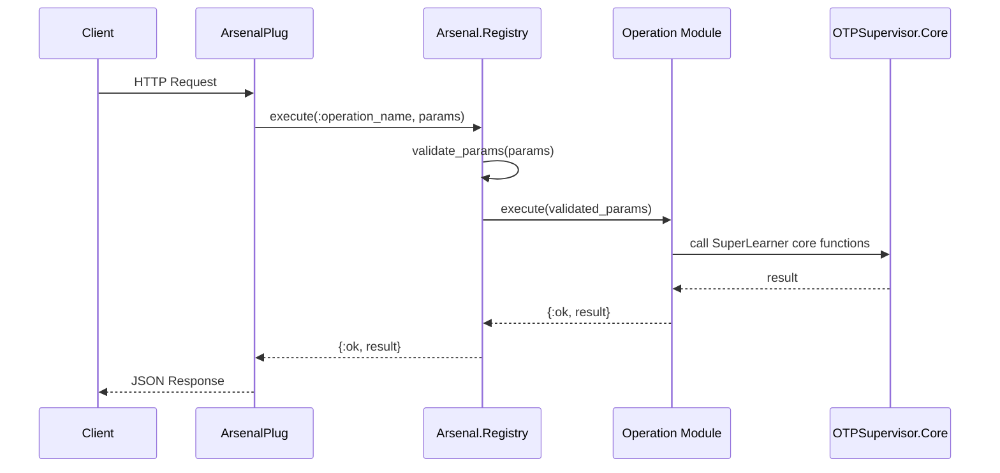
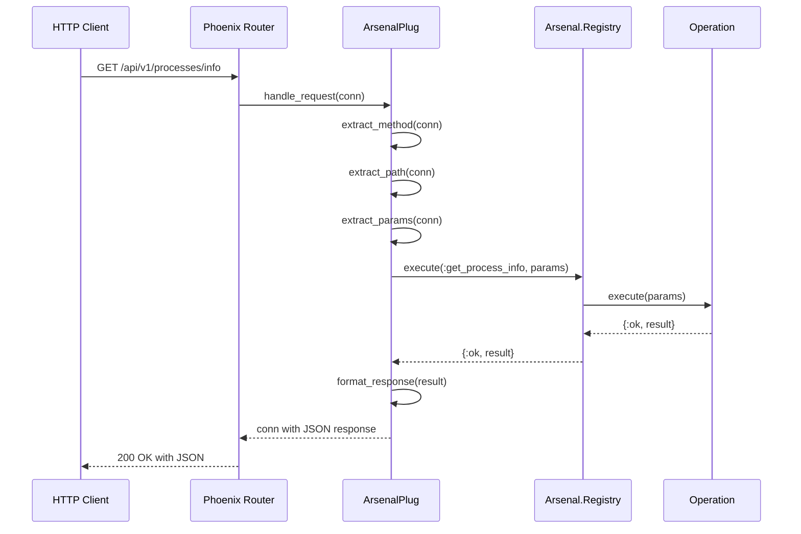
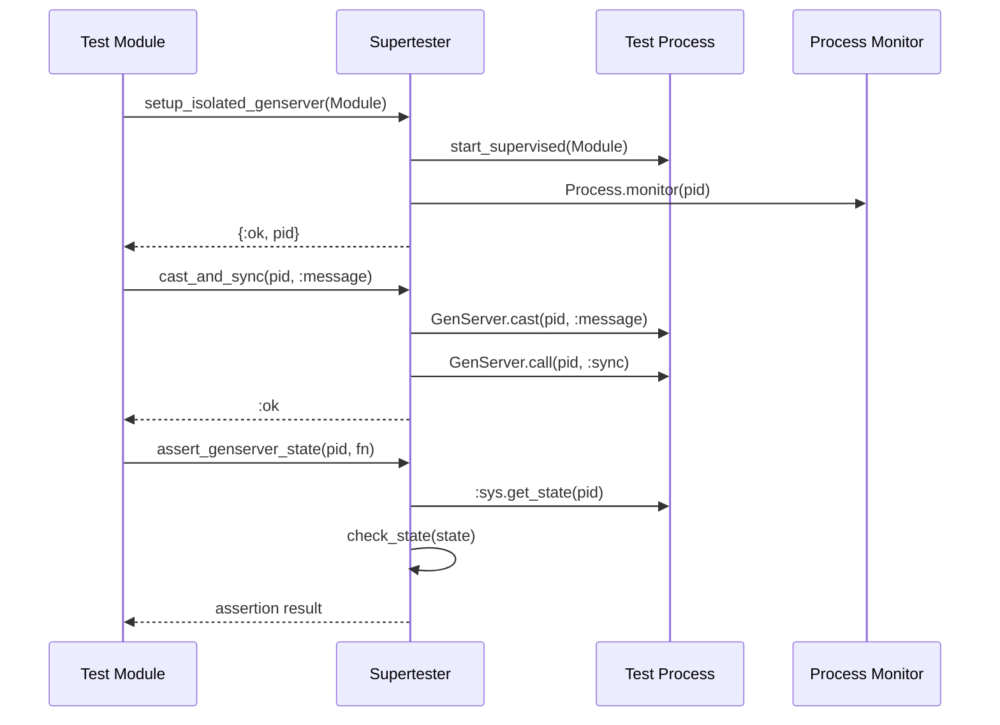
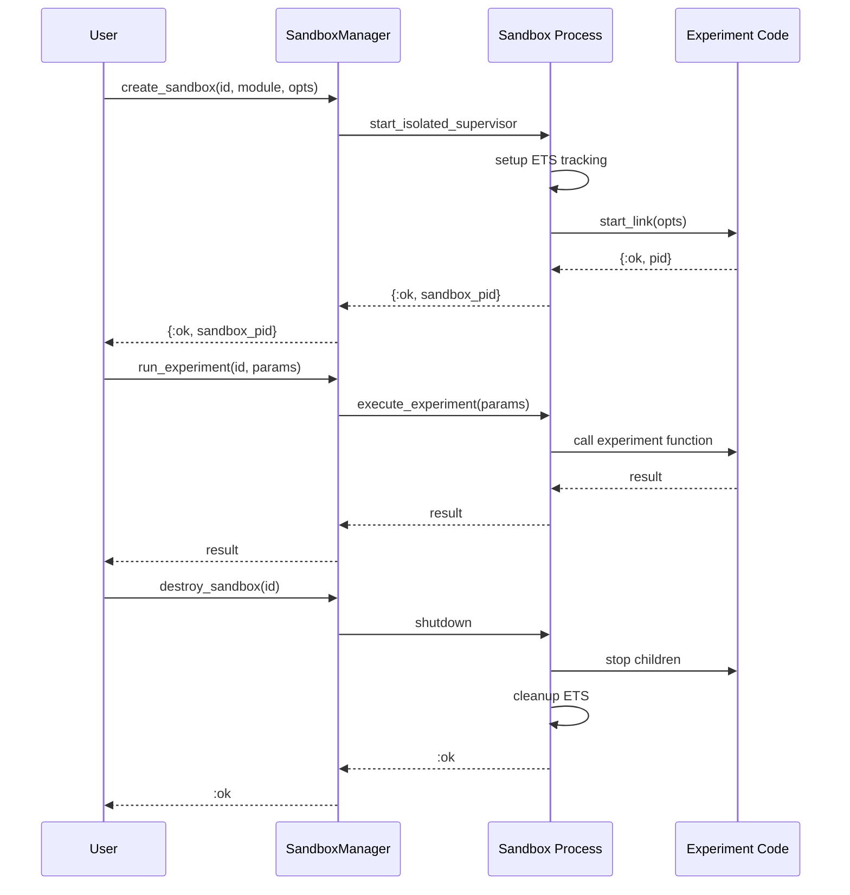
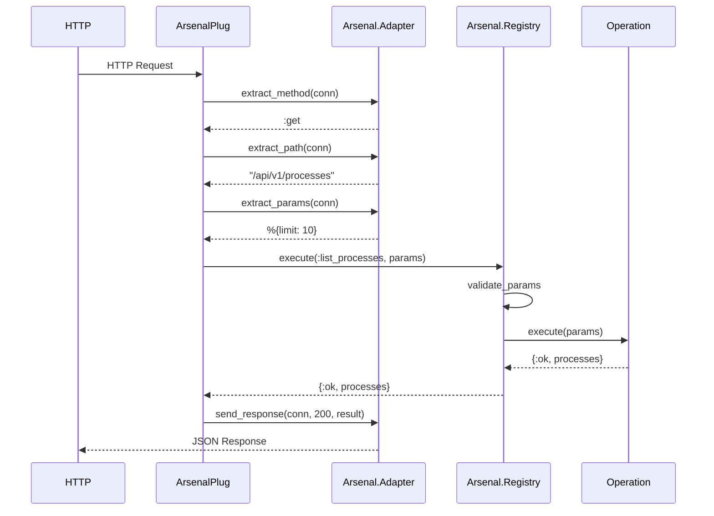

# Library Interaction Patterns

**Document Version:** 1.0
**Date:** 2025-10-07
**Status:** Design Phase

## Overview

This document details how the six libraries in the SuperLearner ecosystem interact with each other, including data flows, API contracts, and integration points.

## Interaction Matrix

| From ↓ / To → | SuperLearner | Supertester | Arsenal | ArsenalPlug | OTPSandbox | Playwriter |
|---------------|--------------|-------------|---------|-------------|------------|------------|
| **SuperLearner** | - | Test | Embed | Use | Path Dep | Dev/Test |
| **Supertester** | - | - | - | - | Test | - |
| **Arsenal** | - | - | - | Required By | - | - |
| **ArsenalPlug** | - | - | Require | - | - | - |
| **OTPSandbox** | - | - | - | - | - | - |
| **Playwriter** | - | - | - | - | - | - |

**Legend:**
- **Embed**: Code embedded/vendored
- **Use**: Runtime dependency
- **Test**: Test-only dependency
- **Dev/Test**: Development and test dependency
- **Path Dep**: Local path dependency
- **Require**: Hard runtime dependency
- **Required By**: Used as dependency

---

## 1. SuperLearner ↔ Arsenal

### Current Integration: EMBEDDED

**Status:** ✅ Arsenal code is embedded in SuperLearner

**Location:** `lib/otp_supervisor/core/arsenal/`

**Files:**
```
lib/otp_supervisor/core/arsenal/
├── operation.ex                    # Arsenal.Operation behavior
├── registry.ex                     # Arsenal.Registry
├── test_runner.ex                  # Test utilities
└── operations/
    ├── create_sandbox.ex
    ├── destroy_sandbox.ex
    ├── get_process_info.ex
    ├── get_sandbox_info.ex
    ├── hot_reload_sandbox.ex
    ├── kill_process.ex
    ├── list_sandboxes.ex
    ├── list_supervisors.ex
    ├── restart_sandbox.ex
    ├── send_message.ex
    ├── trace_process.ex
    ├── distributed/
    │   ├── cluster_health.ex
    │   ├── cluster_supervision_trees.ex
    │   ├── cluster_topology.ex
    │   ├── node_info.ex
    │   └── process_list.ex
    └── storage/
        └── trace_session_storage.ex
```

### Data Flow



### API Contract

#### Registry API
```elixir
# Registration
Arsenal.Registry.register(:operation_name, OperationModule)

# Execution
{:ok, result} = Arsenal.Registry.execute(:operation_name, %{param: value})

# Introspection
{:ok, metadata} = Arsenal.Registry.get_metadata(:operation_name)
operations = Arsenal.Registry.list_by_category(:process)
```

#### Operation Behavior
```elixir
defmodule MyOperation do
  use Arsenal.Operation

  @impl true
  def name(), do: :my_operation

  @impl true
  def category(), do: :custom

  @impl true
  def description(), do: "Operation description"

  @impl true
  def params_schema(), do: %{
    param1: [type: :string, required: true],
    param2: [type: :integer, default: 0]
  }

  @impl true
  def execute(params), do: {:ok, result}

  @impl true
  def metadata(), do: %{requires_authentication: false}

  @impl true
  def rest_config(), do: %{
    method: :get,
    path: "/api/v1/custom/operation",
    summary: "Custom operation"
  }
end
```

### Integration Points

1. **Application Startup** (`lib/otp_supervisor/application.ex:28`)
   ```elixir
   OTPSupervisor.Core.Arsenal.Registry
   ```

2. **Operation Registration** (Currently automatic via module discovery)

3. **Core Function Calls** (Operations call SuperLearner functions)
   ```elixir
   # In operations
   OTPSupervisor.Core.Control.list_processes()
   OTPSupervisor.Core.SandboxManager.create_sandbox(id, module)
   OTPSupervisor.Distributed.ClusterStateManager.get_cluster_topology()
   ```

---

## 2. SuperLearner ↔ Arsenal Plug

### Current Integration: DEPENDENCY

**Status:** ⚠️ Needs verification in router configuration

**Expected Integration:**
```elixir
# lib/otp_supervisor_web/router.ex
defmodule OtpSupervisorWeb.Router do
  use OtpSupervisorWeb, :router

  pipeline :arsenal do
    plug :accepts, ["json"]
    plug ArsenalPlug
  end

  scope "/api/v1", OtpSupervisorWeb do
    pipe_through [:api, :arsenal]

    # Arsenal documentation
    get "/arsenal/docs", ArsenalPlug.ArsenalController, :docs
    get "/arsenal/operations", ArsenalPlug.ArsenalController, :list_operations

    # Dynamic operation routing
    match :*, "/*path", ArsenalPlug.ArsenalController, :operation_handler
  end
end
```

### Data Flow



### API Contract

#### ArsenalPlug Adapter Behavior
```elixir
defmodule ArsenalPlug do
  @behaviour Arsenal.Adapter

  @impl true
  def extract_method(%Plug.Conn{method: method}), do: method

  @impl true
  def extract_path(%Plug.Conn{request_path: path}), do: path

  @impl true
  def extract_params(%Plug.Conn{params: params}), do: params

  @impl true
  def send_response(conn, status, body), do:
    Plug.Conn.send_resp(conn, status, Jason.encode!(body))

  @impl true
  def send_error(conn, status, error), do:
    send_response(conn, status, %{error: error})
end
```

### Integration Needs

1. **Router Configuration** - Add Arsenal routes to router
2. **Error Handling** - Ensure proper error responses
3. **Authentication** - Add auth middleware if needed
4. **Rate Limiting** - Consider rate limits for operations
5. **CORS** - Configure CORS for API access

---

## 3. SuperLearner ↔ Supertester

### Current Integration: TEST DEPENDENCY

**Status:** ✅ Used throughout test suite

**Usage Pattern:**
```elixir
# test/support/supervisor_test_helper.ex
defmodule OtpSupervisor.SupervisorTestHelper do
  import Supertester.OTPHelpers
  import Supertester.GenServerHelpers
  import Supertester.Assertions

  def setup_test_supervisor(context) do
    {:ok, sup_pid} = setup_isolated_supervisor(
      TestDemoSupervisor,
      name: unique_name()
    )

    %{supervisor: sup_pid}
  end
end
```

### Data Flow



### API Contract

#### Core Helpers Used
```elixir
# Setup helpers
{:ok, pid} = setup_isolated_genserver(Module, opts)
{:ok, sup} = setup_isolated_supervisor(Module, opts)

# Synchronization
:ok = wait_for_process_restart(old_pid, supervisor, timeout)
:ok = wait_for_genserver_sync(pid, timeout)
:ok = cast_and_sync(pid, message, timeout)

# Assertions
assert_process_alive(pid)
assert_process_dead(pid)
assert_genserver_state(pid, expected_or_fn)
assert_child_count(supervisor, count)
assert_all_children_alive(supervisor)
assert_no_process_leaks(fn -> operation() end)

# Testing
test_server_crash_recovery(pid, reason)
concurrent_calls(pid, function, count)
```

### Integration Benefits

1. **Deterministic Tests** - No `Process.sleep/1` needed
2. **Async Testing** - All tests run with `async: true`
3. **Process Isolation** - No name clashes or state leakage
4. **Better Assertions** - OTP-aware test assertions
5. **Chaos Testing** - Built-in crash and recovery testing

---

## 4. SuperLearner ↔ OTP Sandbox

### Current Integration: PATH DEPENDENCY

**Status:** ⚠️ Minimal, functionality embedded in SandboxManager

**Current Dependency:**
```elixir
# mix.exs
{:otp_sandbox, path: "./sandbox/examples/otp_sandbox"}
```

**Actual Implementation Location:**
`lib/otp_supervisor/core/sandbox_manager.ex`

### Expected Interaction Pattern

```elixir
# Future: OTP Sandbox as standalone library
defmodule OTPSandbox do
  @callback init(opts :: keyword()) :: {:ok, state :: term()} | {:error, term()}
  @callback handle_experiment(experiment :: term(), state :: term()) ::
    {:ok, result :: term()} | {:error, term()}
end

# Usage in SuperLearner
defmodule OTPSupervisor.Core.SandboxManager do
  def create_sandbox(id, experiment_module, opts) do
    case OTPSandbox.create(id, experiment_module, opts) do
      {:ok, sandbox_pid} ->
        track_sandbox(id, sandbox_pid, experiment_module)
        {:ok, sandbox_pid}
      error -> error
    end
  end
end
```

### Data Flow



### Integration Needs

1. **Extract Library** - Move sandbox code to standalone library
2. **Define API** - Create clean public API
3. **Add Examples** - Demonstrate standalone usage
4. **Integration Layer** - Clean integration with SuperLearner
5. **Documentation** - Comprehensive usage docs

---

## 5. SuperLearner ↔ Playwriter

### Current Integration: DEV/TEST DEPENDENCY

**Status:** ⚠️ Listed but usage unclear

**Current Dependency:**
```elixir
# mix.exs
{:playwriter, github: "nshkrdotcom/playwriter", only: [:dev, :test]}
```

### Potential Use Cases

#### 1. UI Testing
```elixir
# test/otp_supervisor_web/live/supervisor_live_test.exs
defmodule OtpSupervisorWeb.SupervisorLiveTest do
  use OtpSupervisorWeb.ConnCase

  test "supervisor dashboard renders correctly" do
    {:ok, html} = Playwriter.with_browser(%{}, fn page ->
      Playwright.Page.goto(page, "http://localhost:4000/supervisors")
      Playwright.Page.wait_for_selector(page, ".supervisor-tree")
      Playwright.Page.content(page)
    end)

    assert html =~ "Supervisor Dashboard"
  end
end
```

#### 2. Screenshot Generation
```elixir
# Script: generate_documentation_screenshots.exs
defmodule DocScreenshots do
  def generate_all do
    pages = [
      {"supervisors", "Supervisor Dashboard"},
      {"system", "System Analytics"},
      {"api/v1/arsenal/docs", "API Documentation"}
    ]

    for {path, name} <- pages do
      url = "http://localhost:4000/#{path}"
      filename = "img/#{String.replace(path, "/", "_")}.png"
      {:ok, _} = Playwriter.screenshot(url, filename)
      IO.puts("Generated #{name}: #{filename}")
    end
  end
end

DocScreenshots.generate_all()
```

#### 3. End-to-End Testing
```elixir
test "complete workflow: create sandbox, run experiment, destroy" do
  {:ok, result} = Playwriter.with_browser(%{}, fn page ->
    # Navigate to sandbox page
    Playwright.Page.goto(page, "http://localhost:4000/sandboxes")

    # Create sandbox
    Playwright.Page.click(page, "#create-sandbox")
    Playwright.Page.fill(page, "#sandbox-name", "test_sandbox")
    Playwright.Page.click(page, "#submit")
    Playwright.Page.wait_for_selector(page, ".sandbox-created")

    # Verify sandbox appears
    Playwright.Page.click(page, "#sandbox-test_sandbox")
    Playwright.Page.wait_for_selector(page, ".sandbox-details")

    # Run experiment
    Playwright.Page.click(page, "#run-experiment")
    Playwright.Page.wait_for_selector(page, ".experiment-complete")

    # Capture result
    result_text = Playwright.Page.text_content(page, ".experiment-result")

    # Cleanup
    Playwright.Page.click(page, "#destroy-sandbox")
    Playwright.Page.wait_for_selector(page, ".sandbox-destroyed")

    result_text
  end)

  assert result =~ "success"
end
```

### Integration Opportunities

1. **Visual Testing** - Screenshot comparison for UI changes
2. **E2E Test Suite** - Complete user workflows
3. **Documentation** - Auto-generate screenshots for docs
4. **Demo Videos** - Script automated demos
5. **Accessibility Testing** - Test keyboard navigation, screen readers

---

## 6. Arsenal ↔ Arsenal Plug

### Current Integration: REQUIRED DEPENDENCY

**Status:** ✅ Design complete, needs implementation verification

**Dependency:**
```elixir
# arsenal_plug/mix.exs
defp deps do
  [
    {:arsenal, "~> 0.1.0"}
  ]
end
```

### Data Flow



### API Contract

#### ArsenalPlug provides
```elixir
# Main handler
ArsenalPlug.call(conn, opts)

# Controller actions
ArsenalPlug.ArsenalController.docs(conn, _params)
ArsenalPlug.ArsenalController.list_operations(conn, _params)
ArsenalPlug.ArsenalController.operation_handler(conn, _params)
```

#### Arsenal provides
```elixir
# Registry operations
Arsenal.Registry.execute(operation_name, params)
Arsenal.Registry.list_operations()
Arsenal.Registry.get_metadata(operation_name)

# Documentation
Arsenal.generate_api_docs()

# Adapter behavior for framework integration
@callback extract_method(request :: any()) :: atom()
@callback extract_path(request :: any()) :: String.t()
@callback extract_params(request :: any()) :: map()
@callback send_response(request :: any(), status :: integer(), body :: map()) :: any()
```

### Integration Pattern

```elixir
# In Phoenix application
defmodule MyApp.Application do
  def start(_type, _args) do
    children = [
      # Start Arsenal registry
      Arsenal.Registry,

      # Register operations
      {Task, fn -> register_operations() end},

      # Phoenix endpoint
      MyAppWeb.Endpoint
    ]
  end

  defp register_operations do
    Arsenal.Registry.register(:list_processes, Arsenal.Operations.ListProcesses)
    Arsenal.Registry.register(:get_process_info, Arsenal.Operations.GetProcessInfo)
    # ... more operations
  end
end
```

---

## 7. Supertester ↔ OTP Sandbox

### Potential Integration: TEST SUPPORT

**Status:** ❌ Not currently integrated, opportunity identified

**Opportunity:** Supertester could enhance OTP Sandbox testing

### Proposed Integration

```elixir
# In OTP Sandbox test suite
defmodule OTPSandbox.IsolationTest do
  use ExUnit.Case, async: true
  import Supertester.OTPHelpers
  import Supertester.Assertions

  test "sandbox provides complete process isolation" do
    # Create two sandboxes with same module
    {:ok, sandbox1} = OTPSandbox.create("test1", Counter, initial: 0)
    {:ok, sandbox2} = OTPSandbox.create("test2", Counter, initial: 100)

    # Use Supertester helpers for synchronization
    :ok = wait_for_genserver_sync(sandbox1)
    :ok = wait_for_genserver_sync(sandbox2)

    # Modify sandbox1
    :ok = cast_and_sync(sandbox1, {:increment, 5})

    # Use Supertester assertions
    assert_genserver_state(sandbox1, fn state -> state.count == 5 end)
    assert_genserver_state(sandbox2, fn state -> state.count == 100 end)

    # Test crash recovery with Supertester
    test_server_crash_recovery(sandbox1, :kill)
    assert_genserver_state(sandbox1, fn state -> state.count == 0 end)
  end

  test "no process leaks from sandbox operations" do
    assert_no_process_leaks(fn ->
      {:ok, sandbox} = OTPSandbox.create("leak_test", Worker)
      :ok = OTPSandbox.run_experiment(sandbox, :complex_operation)
      :ok = OTPSandbox.destroy(sandbox)
    end)
  end
end
```

### Benefits

1. **Better Test Quality** - Deterministic sandbox testing
2. **Async Tests** - Run sandbox tests in parallel
3. **Resource Verification** - Ensure no leaks
4. **Crash Testing** - Test sandbox resilience
5. **Cleaner Tests** - Less boilerplate

---

## Cross-Library Patterns

### 1. Error Handling Convention

**Recommended Pattern:**
```elixir
# Success
{:ok, result}
{:ok, result, metadata}

# Errors
{:error, :not_found}
{:error, :invalid_params, details}
{:error, {:validation_failed, field, reason}}

# Pattern matching
case operation() do
  {:ok, result} -> handle_success(result)
  {:ok, result, meta} -> handle_success_with_meta(result, meta)
  {:error, reason} -> handle_error(reason)
  {:error, reason, details} -> handle_detailed_error(reason, details)
end
```

### 2. Telemetry Events

**Convention:**
```elixir
# Event naming: [:library, :component, :event]
[:supertester, :helper, :start]
[:arsenal, :operation, :execute]
[:otp_sandbox, :experiment, :complete]
[:playwriter, :browser, :navigate]

# Metadata
%{
  duration: microseconds,
  result: :ok | :error,
  metadata: operation_specific_data
}
```

### 3. Configuration Pattern

**Recommended Structure:**
```elixir
# config/config.exs
config :supertester,
  default_timeout: 5_000,
  isolation_level: :full

config :arsenal,
  operation_timeout: 30_000,
  enable_telemetry: true

config :otp_sandbox,
  max_sandboxes: 100,
  default_strategy: :one_for_one

config :playwriter,
  browser_type: :chromium,
  headless: true
```

### 4. Documentation Pattern

**Module Documentation:**
```elixir
defmodule MyLibrary.Component do
  @moduledoc """
  Brief description of component.

  ## Purpose
  What problem does this solve?

  ## Usage
  Basic usage example.

  ## Examples
      iex> MyLibrary.Component.function()
      {:ok, result}

  ## Integration
  How this component integrates with ecosystem.
  """
end
```

---

## Integration Quality Checklist

### For Each Library Pair

- [ ] **API Contract Defined** - Clear function signatures and behavior
- [ ] **Error Handling** - Consistent error tuple patterns
- [ ] **Documentation** - Usage examples and integration guides
- [ ] **Tests** - Integration tests between libraries
- [ ] **Telemetry** - Events for monitoring integration points
- [ ] **Examples** - Working code examples
- [ ] **Version Compatibility** - Version constraints documented

### Current Status

| Integration | Contract | Errors | Docs | Tests | Telemetry | Examples | Versions |
|-------------|----------|--------|------|-------|-----------|----------|----------|
| SL → Arsenal | ✅ | ✅ | ⚠️ | ✅ | ⚠️ | ✅ | ✅ |
| SL → ArsenalPlug | ⚠️ | ⚠️ | ❌ | ❌ | ❌ | ❌ | ⚠️ |
| SL → Supertester | ✅ | ✅ | ✅ | ✅ | ✅ | ✅ | ✅ |
| SL → OTPSandbox | ⚠️ | ⚠️ | ❌ | ⚠️ | ❌ | ❌ | ✅ |
| SL → Playwriter | ❌ | ❌ | ❌ | ❌ | ❌ | ❌ | ✅ |
| Arsenal → ArsenalPlug | ✅ | ✅ | ✅ | ⚠️ | ⚠️ | ✅ | ✅ |
| Supertester → OTPSandbox | ❌ | ❌ | ❌ | ❌ | ❌ | ❌ | ❌ |

**Legend:** ✅ Complete | ⚠️ Partial | ❌ Missing

---

## Next Steps

1. **Verify ArsenalPlug Integration** - Check router configuration
2. **Extract OTP Sandbox** - Move to standalone library
3. **Document Playwriter Usage** - Create examples for SuperLearner
4. **Add Integration Tests** - Test library boundaries
5. **Create Cross-Library Examples** - Demonstrate ecosystem value
6. **Standardize Patterns** - Apply conventions across all libraries

See **03_integration_architecture.md** for technical implementation details.
