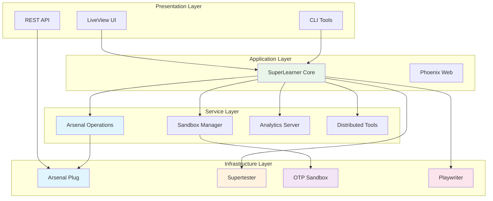
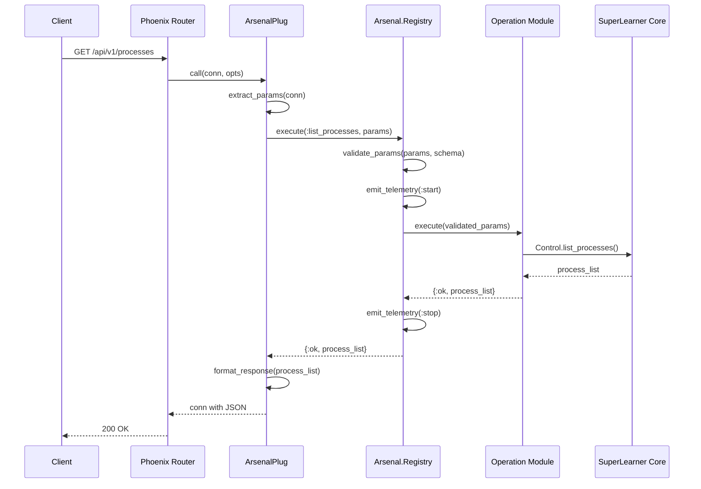
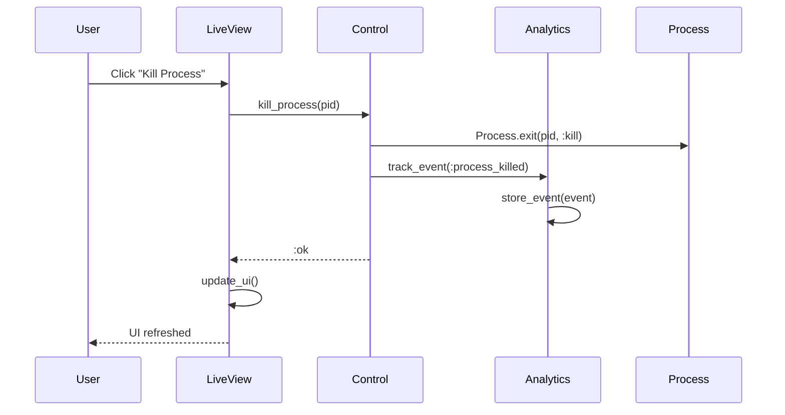
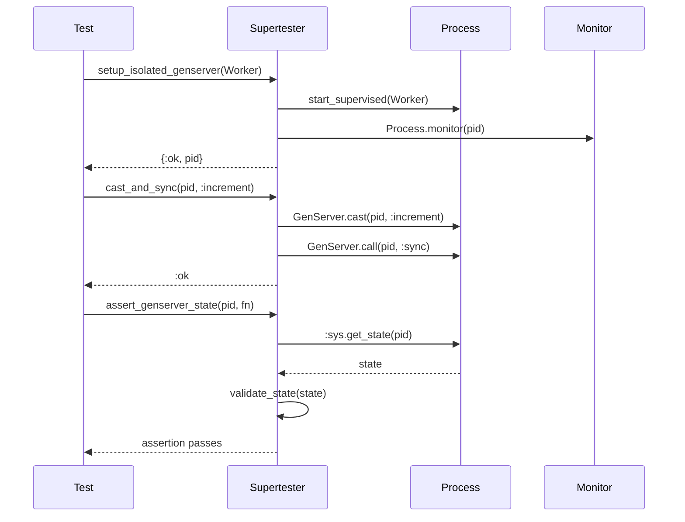
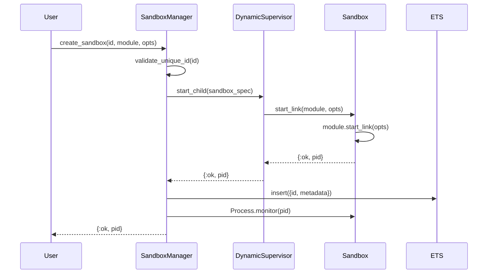

# Integration Architecture

**Document Version:** 1.0
**Date:** 2025-10-07
**Status:** Design Phase

## Overview

This document defines the technical architecture for integrating the six libraries in the SuperLearner ecosystem, including module organization, supervision trees, API boundaries, and implementation patterns.

## Architectural Principles

### 1. Separation of Concerns
- Each library owns a distinct domain
- Clear boundaries prevent coupling
- Shared concerns use protocols/behaviors

### 2. Dependency Inversion
- Libraries depend on abstractions (behaviors)
- Concrete implementations in higher layers
- Enables testing and flexibility

### 3. Single Direction Flow
```
Playwriter
    ↓
SuperLearner → Arsenal → Arsenal Plug
    ↓              ↓
OTP Sandbox   (standalone)
    ↓
Supertester
```

### 4. Composition Over Inheritance
- Small, focused modules
- Compose functionality through delegation
- Avoid deep inheritance hierarchies

---

## System Architecture

### High-Level Component View



---

## Module Organization

### SuperLearner Module Structure

```
lib/
├── otp_supervisor.ex                      # Main module
├── otp_supervisor/
│   ├── application.ex                     # OTP Application
│   │
│   ├── core/                             # Core Business Logic
│   │   ├── control.ex                    # Central API
│   │   ├── analytics_server.ex           # Monitoring
│   │   ├── sandbox_manager.ex            # Sandbox coordination
│   │   ├── message_tracer.ex             # Debugging
│   │   ├── system_analyzer.ex            # Analysis
│   │   ├── module_version_manager.ex     # Hot reload
│   │   └── isolated_compiler.ex          # Compilation
│   │
│   ├── core/arsenal/                     # Arsenal Integration
│   │   ├── operation.ex                  # Operation behavior
│   │   ├── registry.ex                   # Operation registry
│   │   ├── test_runner.ex                # Testing
│   │   └── operations/                   # Operation modules
│   │       ├── process_operations.ex
│   │       ├── sandbox_operations.ex
│   │       ├── distributed/
│   │       └── storage/
│   │
│   ├── distributed/                      # Cluster Support
│   │   ├── tool_manager.ex
│   │   ├── cluster_state_manager.ex
│   │   └── single_node_simulator.ex
│   │
│   ├── sandbox/                          # Demo Supervisors
│   │   ├── supervisors/
│   │   └── workers/
│   │
│   └── testing/                          # Test Infrastructure
│       ├── auto_cluster_manager.ex
│       └── test_cluster/
│
├── otp_supervisor_web.ex                 # Web module
└── otp_supervisor_web/
    ├── components/                       # LiveView components
    ├── controllers/                      # REST controllers
    │   └── api/v1/                      # API endpoints
    ├── live/                            # LiveView pages
    │   ├── supervisor_live.ex
    │   └── system_dashboard_live.ex
    ├── router.ex                        # Route definitions
    ├── endpoint.ex                      # Phoenix endpoint
    └── telemetry.ex                     # Metrics
```

### External Library Integration Points

```
mix.exs dependencies:
├── {:supertester, ...}          → test/support/*.ex (test only)
├── {:arsenal, ...}              → lib/otp_supervisor/core/arsenal/
├── {:arsenal_plug, ...}         → lib/otp_supervisor_web/router.ex
├── {:otp_sandbox, ...}          → lib/otp_supervisor/core/sandbox_manager.ex
└── {:playwriter, ...}           → test/**/*_test.exs (dev/test)
```

---

## Supervision Tree Architecture

### SuperLearner Application Supervision Tree

```
OtpSupervisor.Supervisor (one_for_one)
│
├── OtpSupervisorWeb.Telemetry
│   └── TelemetryMetrics supervisor
│
├── Phoenix.PubSub
│   └── PubSub processes
│
├── Finch
│   └── HTTP client pool
│
├── Registry (TracerRegistry)
│   └── Message tracer registry
│
├── OTPSupervisor.Core.AnalyticsServer
│   └── GenServer (singleton)
│
├── OTPSupervisor.Core.ModuleVersionManager
│   └── GenServer (hot reload)
│
├── OTPSupervisor.Core.SandboxManager
│   └── GenServer (sandbox coordination)
│       ├── Tracks sandbox supervisors
│       └── ETS table for metadata
│
├── OTPSupervisor.Core.Arsenal.Registry
│   └── GenServer (operation registry)
│
├── OTPSupervisor.Distributed.ToolManager
│   └── GenServer (cluster tools)
│
├── OTPSupervisor.Distributed.SingleNodeSimulator
│   └── GenServer (dev mode simulation)
│
├── OTPSupervisor.Distributed.ClusterStateManager
│   └── GenServer (cluster topology)
│
├── DynamicSupervisor (OtpSupervisor.DynamicSupervisor)
│   └── Test cluster servers (dynamic)
│
├── TestCluster.Manager (test env only)
│   └── Test cluster coordination
│
└── OtpSupervisorWeb.Endpoint
    └── Phoenix endpoint processes
```

### Sandbox Supervision Pattern

```
SandboxManager (GenServer)
│
├── ETS Table: sandbox_metadata
│   ├── {sandbox_id, %{pid, module, config, created_at}}
│   └── Fast O(1) lookups
│
└── Monitors sandbox supervisors
    │
    ├── Sandbox_1 (DynamicSupervisor)
    │   └── User-defined supervisor
    │       └── Worker processes
    │
    ├── Sandbox_2 (DynamicSupervisor)
    │   └── User-defined supervisor
    │       └── Worker processes
    │
    └── Sandbox_N (...)
```

### Arsenal Registry Pattern

```
Arsenal.Registry (GenServer)
│
├── State:
│   ├── operations: %{name => module}
│   ├── metadata_cache: %{name => metadata}
│   └── telemetry_handlers: [...]
│
└── Operation Execution Flow:
    1. Validate params against schema
    2. Emit telemetry start event
    3. Execute operation
    4. Emit telemetry stop/exception event
    5. Return result
```

---

## API Boundary Definitions

### 1. SuperLearner Public API

**Module:** `OTPSupervisor` (main module)

```elixir
defmodule OTPSupervisor do
  @moduledoc """
  Main entry point for the SuperLearner educational platform.
  """

  # Delegation to core modules
  defdelegate list_supervisors(), to: OTPSupervisor.Core.Control
  defdelegate list_processes(opts \\ []), to: OTPSupervisor.Core.Control
  defdelegate get_process_info(pid), to: OTPSupervisor.Core.Control
  defdelegate kill_process(pid), to: OTPSupervisor.Core.Control

  # Sandbox operations
  defdelegate create_sandbox(id, module, opts \\ []),
    to: OTPSupervisor.Core.SandboxManager
  defdelegate list_sandboxes(),
    to: OTPSupervisor.Core.SandboxManager
  defdelegate destroy_sandbox(id),
    to: OTPSupervisor.Core.SandboxManager

  # Analytics
  defdelegate get_supervisor_stats(sup_pid),
    to: OTPSupervisor.Core.AnalyticsServer
  defdelegate get_restart_history(sup_pid),
    to: OTPSupervisor.Core.AnalyticsServer
end
```

### 2. Arsenal Public API

**Module:** `Arsenal`

```elixir
defmodule Arsenal do
  @moduledoc """
  Metaprogramming framework for REST APIs from OTP operations.
  """

  # Operation definition
  defmacro __using__(_opts) do
    quote do
      @behaviour Arsenal.Operation
      # Inject helpers and defaults
    end
  end

  # Operation execution (delegates to Registry)
  defdelegate execute(operation_name, params),
    to: Arsenal.Registry

  defdelegate list_operations(),
    to: Arsenal.Registry

  defdelegate register_operation(module),
    to: Arsenal.Registry

  defdelegate generate_api_docs(),
    to: Arsenal.Documentation
end
```

### 3. Arsenal Plug Public API

**Module:** `ArsenalPlug`

```elixir
defmodule ArsenalPlug do
  @moduledoc """
  Phoenix/Plug adapter for Arsenal operations.
  """

  @behaviour Plug
  @behaviour Arsenal.Adapter

  # Plug callbacks
  def init(opts), do: opts
  def call(conn, opts)

  # Arsenal.Adapter callbacks
  def extract_method(conn)
  def extract_path(conn)
  def extract_params(conn)
  def send_response(conn, status, body)
  def send_error(conn, status, error)
end

defmodule ArsenalPlug.ArsenalController do
  use Phoenix.Controller

  def docs(conn, _params)
  def list_operations(conn, _params)
  def operation_handler(conn, _params)
end
```

### 4. Supertester Public API

**Module:** `Supertester`

```elixir
defmodule Supertester do
  # Re-export main helpers
  defdelegate setup_isolated_genserver(module, opts \\ []),
    to: Supertester.OTPHelpers

  defdelegate setup_isolated_supervisor(module, opts \\ []),
    to: Supertester.OTPHelpers

  defdelegate cast_and_sync(pid, message, timeout \\ 5000),
    to: Supertester.GenServerHelpers

  defdelegate assert_genserver_state(pid, expected),
    to: Supertester.Assertions

  defdelegate assert_process_alive(pid),
    to: Supertester.Assertions
end
```

### 5. OTP Sandbox Public API (Proposed)

**Module:** `OTPSandbox`

```elixir
defmodule OTPSandbox do
  @moduledoc """
  Isolated OTP experimentation environments.
  """

  @type sandbox_id :: String.t()
  @type supervisor_module :: module()
  @type sandbox_opts :: keyword()

  @callback init(opts :: keyword()) ::
    {:ok, state :: term()} | {:error, term()}

  @callback handle_experiment(experiment :: term(), state :: term()) ::
    {:ok, result :: term()} | {:error, term()}

  # Core API
  @spec create(sandbox_id, supervisor_module, sandbox_opts) ::
    {:ok, pid()} | {:error, term()}
  def create(id, module, opts \\ [])

  @spec list() :: [{sandbox_id, pid(), supervisor_module}]
  def list()

  @spec get_info(sandbox_id) ::
    {:ok, map()} | {:error, :not_found}
  def get_info(id)

  @spec restart(sandbox_id) :: :ok | {:error, term()}
  def restart(id)

  @spec destroy(sandbox_id) :: :ok | {:error, term()}
  def destroy(id)

  # Experiment execution
  @spec run_experiment(sandbox_id, term()) ::
    {:ok, term()} | {:error, term()}
  def run_experiment(id, experiment)
end
```

### 6. Playwriter Public API

**Module:** `Playwriter`

```elixir
defmodule Playwriter do
  @moduledoc """
  Cross-platform browser automation with Playwright.
  """

  @type browser_opts :: %{
    optional(:use_windows_browser) => boolean(),
    optional(:browser_type) => :chromium | :firefox | :webkit,
    optional(:headless) => boolean(),
    optional(:chrome_profile) => String.t(),
    optional(:ws_endpoint) => String.t()
  }

  # Main composable API
  @spec with_browser(browser_opts, (Playwright.Page.t() -> result)) ::
    {:ok, result} | {:error, term()}
  def with_browser(opts, fun)

  # Convenience functions
  @spec screenshot(url :: String.t(), path :: String.t(), browser_opts) ::
    {:ok, binary()} | {:error, term()}
  def screenshot(url, path, opts \\ %{})

  @spec fetch_html(url :: String.t(), browser_opts) ::
    {:ok, String.t()} | {:error, term()}
  def fetch_html(url, opts \\ %{})
end
```

---

## Data Flow Patterns

### 1. HTTP Request → Operation Execution



### 2. LiveView → Core → Analytics



### 3. Test → Supertester → Process



### 4. Sandbox Creation Flow



---

## Configuration Architecture

### Environment-Based Configuration

```elixir
# config/config.exs (shared)
import Config

config :otp_supervisor,
  ecto_repos: []

# Core system configuration
config :otp_supervisor, OTPSupervisor.Core.AnalyticsServer,
  scan_interval: 2_000,
  max_events_per_supervisor: 1_000

config :otp_supervisor, OTPSupervisor.Core.SandboxManager,
  max_sandboxes: 100,
  cleanup_interval: 60_000

# Arsenal configuration
config :arsenal,
  operation_timeout: 30_000,
  enable_telemetry: true,
  telemetry_prefix: [:arsenal, :operation]

# Import environment-specific config
import_config "#{config_env()}.exs"
```

```elixir
# config/dev.exs
import Config

config :otp_supervisor, OtpSupervisorWeb.Endpoint,
  http: [port: 4000],
  debug_errors: true,
  code_reloader: true,
  check_origin: false

# Development-only features
config :otp_supervisor,
  enable_debug_logging: true,
  simulate_cluster: true

config :playwriter,
  browser_type: :chromium,
  headless: false,
  use_windows_browser: true
```

```elixir
# config/test.exs
import Config

config :otp_supervisor, OtpSupervisorWeb.Endpoint,
  http: [port: 4002],
  server: false

config :otp_supervisor,
  sandbox: :manual,
  enable_debug_logging: false

# Test-specific configuration
config :otp_supervisor, :distributed_testing,
  auto_cluster: true,
  node_count: 3,
  startup_timeout: 10_000

config :supertester,
  default_timeout: 1_000,
  isolation_level: :full

config :playwriter,
  headless: true,
  browser_type: :chromium
```

### Runtime Configuration

```elixir
# config/runtime.exs
import Config

if config_env() == :prod do
  # Production runtime configuration
  config :otp_supervisor, OtpSupervisorWeb.Endpoint,
    url: [host: System.get_env("PHX_HOST") || "localhost"],
    http: [port: String.to_integer(System.get_env("PORT") || "4000")],
    secret_key_base: System.fetch_env!("SECRET_KEY_BASE")

  config :arsenal,
    operation_timeout: String.to_integer(System.get_env("OPERATION_TIMEOUT") || "30000")
end
```

---

## Telemetry Integration

### Event Taxonomy

```elixir
# Arsenal operations
[:arsenal, :operation, :start]
[:arsenal, :operation, :stop]
[:arsenal, :operation, :exception]

# SuperLearner core
[:otp_supervisor, :sandbox, :created]
[:otp_supervisor, :sandbox, :destroyed]
[:otp_supervisor, :process, :killed]
[:otp_supervisor, :analytics, :restart_detected]

# Supertester
[:supertester, :helper, :start]
[:supertester, :helper, :stop]
[:supertester, :assertion, :passed]
[:supertester, :assertion, :failed]

# Playwriter
[:playwriter, :browser, :connected]
[:playwriter, :browser, :navigated]
[:playwriter, :browser, :closed]
```

### Telemetry Handler Setup

```elixir
# lib/otp_supervisor/application.ex
defmodule OtpSupervisor.Application do
  def start(_type, _args) do
    # Attach telemetry handlers
    :telemetry.attach_many(
      "otp-supervisor-telemetry",
      [
        [:arsenal, :operation, :start],
        [:arsenal, :operation, :stop],
        [:arsenal, :operation, :exception],
        [:otp_supervisor, :sandbox, :created],
        [:otp_supervisor, :process, :killed]
      ],
      &OtpSupervisorWeb.Telemetry.handle_event/4,
      nil
    )

    # ... supervision tree
  end
end

# lib/otp_supervisor_web/telemetry.ex
defmodule OtpSupervisorWeb.Telemetry do
  def handle_event([:arsenal, :operation, :stop], measurements, metadata, _config) do
    Logger.info("Operation #{metadata.operation} completed in #{measurements.duration}μs")
    # Store metrics, update dashboards, etc.
  end

  def handle_event([:arsenal, :operation, :exception], measurements, metadata, _config) do
    Logger.error("Operation #{metadata.operation} failed: #{inspect(metadata.error)}")
    # Alert, store failure metrics, etc.
  end

  # ... more handlers
end
```

---

## Error Handling Strategy

### Error Type Hierarchy

```elixir
# Standard OTP errors
:normal                 # Normal shutdown
:shutdown               # Requested shutdown
{:shutdown, reason}     # Shutdown with reason
:kill                   # Forced termination
:timeout                # Operation timeout

# Application errors
{:error, :not_found}
{:error, :invalid_params}
{:error, :unauthorized}
{:error, {:validation_failed, field, reason}}
{:error, {:operation_failed, operation, reason}}

# Library-specific errors
{:error, {:supertester, :process_not_found}}
{:error, {:arsenal, :operation_not_registered}}
{:error, {:sandbox, :sandbox_limit_exceeded}}
{:error, {:playwriter, :browser_connection_failed}}
```

### Error Handling Pattern

```elixir
defmodule OTPSupervisor.ErrorHandler do
  @moduledoc """
  Centralized error handling and normalization.
  """

  def normalize_error({:error, :not_found}), do:
    {:error, :not_found, "Resource not found"}

  def normalize_error({:error, {:validation_failed, field, reason}}), do:
    {:error, :validation_error, "#{field}: #{reason}"}

  def normalize_error({:error, reason}) when is_binary(reason), do:
    {:error, :unknown, reason}

  def normalize_error({:error, reason}), do:
    {:error, :unknown, inspect(reason)}

  def to_http_status(:not_found), do: 404
  def to_http_status(:invalid_params), do: 400
  def to_http_status(:unauthorized), do: 401
  def to_http_status(:validation_error), do: 422
  def to_http_status(:operation_failed), do: 500
  def to_http_status(_), do: 500
end
```

---

## Testing Architecture

### Test Organization

```
test/
├── otp_supervisor/                    # Core tests
│   ├── core/
│   │   ├── control_test.exs
│   │   ├── analytics_server_test.exs
│   │   ├── sandbox_manager_test.exs
│   │   └── arsenal/
│   │       ├── registry_test.exs
│   │       └── operations/
│   │           ├── process_operations_test.exs
│   │           └── sandbox_operations_test.exs
│   │
│   ├── distributed/                   # Distributed tests
│   │   ├── cluster_state_manager_test.exs
│   │   └── tool_manager_test.exs
│   │
│   └── sandbox/                       # Sandbox tests
│       └── workers/
│
├── otp_supervisor_web/                # Web tests
│   ├── live/
│   │   ├── supervisor_live_test.exs
│   │   └── system_dashboard_live_test.exs
│   │
│   └── controllers/
│       └── api/v1/
│           ├── arsenal_controller_test.exs
│           ├── process_controller_test.exs
│           └── sandbox_controller_test.exs
│
├── integration/                       # Cross-library integration tests
│   ├── arsenal_plug_integration_test.exs
│   ├── sandbox_lifecycle_test.exs
│   └── distributed_operations_test.exs
│
└── support/
    ├── conn_case.ex
    ├── data_case.ex
    ├── supervisor_test_helper.ex     # Uses Supertester
    └── cluster_test_helper.ex
```

### Integration Test Pattern

```elixir
# test/integration/arsenal_plug_integration_test.exs
defmodule OtpSupervisor.ArsenalPlugIntegrationTest do
  use OtpSupervisorWeb.ConnCase, async: true
  import Supertester.OTPHelpers
  import Supertester.Assertions

  describe "Arsenal operations via HTTP" do
    test "list processes operation", %{conn: conn} do
      # Create test processes
      {:ok, pid1} = setup_isolated_genserver(DummyWorker)
      {:ok, pid2} = setup_isolated_genserver(DummyWorker)

      # Call API
      conn = get(conn, "/api/v1/processes", %{limit: 10})

      # Verify response
      assert %{"data" => processes} = json_response(conn, 200)
      assert is_list(processes)
      assert length(processes) >= 2

      # Verify our test processes are included
      pids = Enum.map(processes, & &1["pid"])
      assert inspect(pid1) in pids
      assert inspect(pid2) in pids
    end

    test "create and destroy sandbox via API", %{conn: conn} do
      # Create sandbox
      conn = post(conn, "/api/v1/sandboxes", %{
        id: "test_sandbox",
        module: "TestDemoSupervisor"
      })

      assert %{"data" => %{"id" => "test_sandbox"}} = json_response(conn, 201)

      # Verify sandbox exists
      conn = get(conn, "/api/v1/sandboxes/test_sandbox")
      assert %{"data" => sandbox} = json_response(conn, 200)
      assert sandbox["id"] == "test_sandbox"

      # Destroy sandbox
      conn = delete(conn, "/api/v1/sandboxes/test_sandbox")
      assert response(conn, 204)

      # Verify sandbox removed
      assert_no_process_leaks(fn ->
        # Sandbox supervisor and children should be gone
      end)
    end
  end
end
```

---

## Performance Considerations

### 1. Registry Lookups
- **Problem**: O(n) operation lookup in list
- **Solution**: Use ETS table or Map for O(1) lookups

```elixir
defmodule Arsenal.Registry do
  def init(_) do
    {:ok, %{
      operations: %{},  # Map for O(1) lookup
      categories: %{}   # Map of category => [operations]
    }}
  end
end
```

### 2. Sandbox Metadata
- **Current**: ETS table for fast lookups ✅
- **Benefit**: O(1) sandbox info retrieval

### 3. Process Monitoring
- **Pattern**: Use `:erlang.monitor/2` instead of links
- **Benefit**: Unidirectional failure propagation
- **Implementation**: Already used in SandboxManager ✅

### 4. Telemetry Overhead
- **Strategy**: Lazy evaluation of measurements
- **Implementation**:
  ```elixir
  :telemetry.execute(
    [:arsenal, :operation, :stop],
    %{duration: duration},
    %{operation: name}  # Metadata only when needed
  )
  ```

---

## Security Architecture

### 1. Operation Authorization

```elixir
defmodule Arsenal.Operation do
  @callback authorize(params :: map(), context :: map()) ::
    :ok | {:error, term()}

  @optional_callbacks [authorize: 2]
end

# In operation
def authorize(_params, %{user: user}) do
  if user.role in [:admin, :operator] do
    :ok
  else
    {:error, :unauthorized}
  end
end
```

### 2. Sandbox Isolation

```elixir
# Each sandbox is isolated
- Separate supervision tree
- Unique process names
- No shared state
- Monitor-based cleanup
```

### 3. API Rate Limiting

```elixir
# In router
pipeline :api do
  plug :accepts, ["json"]
  plug RateLimiter, max_requests: 100, interval: :minute
end
```

---

## Migration Path

### Phase 1: Verify Current State
1. Check ArsenalPlug in router
2. Verify operation registration
3. Test API endpoints

### Phase 2: Extract OTP Sandbox
1. Create standalone library
2. Define public API
3. Update SuperLearner to use library

### Phase 3: Integrate Playwriter
1. Add UI test suite
2. Create screenshot generation scripts
3. E2E test framework

### Phase 4: Standardize Patterns
1. Apply error handling conventions
2. Add telemetry events
3. Update documentation

---

## Next Steps

See **04_missing_components.md** for gap analysis and **05_implementation_roadmap.md** for phased implementation plan.
