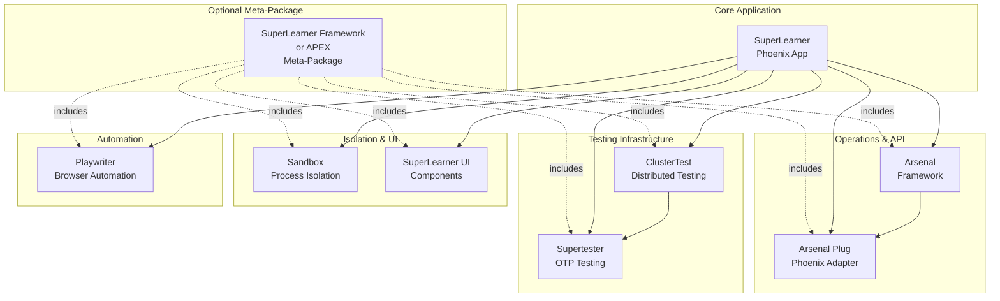

# APEX Framework Analysis: Relation to SuperLearner Ecosystem

**Date:** 2025-10-07
**Status:** Strategic Analysis
**Impact:** 🎯 Major - Changes ecosystem understanding

---

## Executive Discovery

**APEX was a planned umbrella framework** that would package the SuperLearner ecosystem under a unified brand. It represents an **alternative packaging strategy** - not competing libraries, but a different way to organize the same components.

### The Two Strategies

**Strategy A: Individual Libraries (Current)**
- Supertester, Arsenal, Arsenal Plug, Sandbox, Playwriter, SuperLearner
- Each standalone on Hex.pm
- Mix and match as needed

**Strategy B: APEX Framework (Planned)**
- Single "APEX" brand/meta-package
- Same components, different packaging
- Unified documentation and onboarding

---

## APEX Framework Components

### Planned APEX Packages (5-6 packages)

| APEX Package | Maps To | Status | Relationship |
|--------------|---------|--------|--------------|
| **apex** | Meta-package | 📦 Stub | Umbrella for all APEX packages |
| **arsenal** | Arsenal | ✅ Same | Already exists standalone |
| **arsenal_plug** | Arsenal Plug | ✅ Same | Already exists standalone |
| **apex_ui** | SuperLearner UI | 💡 New | UI components extracted |
| **sandbox** | Sandbox | ✅ Same | Already exists standalone |
| **cluster_test** | (in SuperLearner) | 💡 Extract | Test infrastructure |

---

## Key Insight: APEX vs Current Ecosystem

### They're The SAME Components!

**APEX Framework IS:**
- Arsenal (operations) ✅
- Arsenal Plug (Phoenix adapter) ✅
- Sandbox (isolation) ✅
- ApexUI (UI components) 💡
- ClusterTest (distributed testing) 💡
- APEX (meta-package) 📦

**SuperLearner Ecosystem IS:**
- Arsenal ✅
- Arsenal Plug ✅
- Sandbox ✅
- Supertester ✅
- Playwriter ✅
- SuperLearner (application) ✅

### The Difference

**APEX Approach:**
- Unified branding
- Meta-package convenience: `{:apex, "~> 0.0.1"}` gets everything
- Framework-focused positioning
- UI components as library (ApexUI)

**Current Approach:**
- Individual library branding
- Install separately as needed
- Library-focused positioning
- UI as application (SuperLearner)

---

## What APEX Adds (New Ideas)

### 1. ApexUI (UI Components Library) 💡

**Concept:** Extract SuperLearner's UI components into reusable library

**Value:**
- Use SuperLearner's beautiful UI in other apps
- Terminal-themed components as library
- Real-time chart widgets
- 3D cluster visualization

**Current State:**
- README exists (13KB) with full API
- mix.exs configured
- Components designed
- **Status:** Stub implementation, needs extraction

**What to Extract from SuperLearner:**
```
lib/otp_supervisor_web/components/
├── core/
│   ├── terminal_panel.ex
│   ├── chart_widget.ex
│   └── ...
├── layouts/
└── live/
    ├── system_dashboard_live.ex (template)
    └── cluster_visualization_live.ex (template)
```

**Value Proposition:**
- Reusable monitoring dashboards
- Terminal aesthetic for any Phoenix app
- Real-time charts and widgets
- Cluster visualization (3D with Three.js)

---

### 2. ClusterTest (Distributed Testing) 💡

**Concept:** Extract distributed testing from SuperLearner

**Value:**
- Standalone distributed testing tool
- Mix tasks: `mix cluster.test start/stop/run`
- Automated node provisioning
- Health monitoring

**Current State in SuperLearner:**
```
lib/otp_supervisor/test_cluster/
├── manager.ex
├── node_supervisor.ex
└── ...

lib/otp_supervisor/testing/
├── auto_cluster_manager.ex
└── ...
```

**Documented in SuperLearner README:**
```bash
mix cluster.test start
mix cluster.test status
mix cluster.test run
```

**Value Proposition:**
- Automated cluster testing
- No manual node scripts
- Health validation
- Production-grade testing

---

### 3. APEX Meta-Package 📦

**Concept:** Convenience package that includes all components

**Value:**
- One-line install: `{:apex, "~> 0.0.1"}`
- Unified configuration
- Consistent versioning
- Easier onboarding

**Implementation:**
```elixir
# mix.exs
defp deps do
  [
    {:arsenal, "~> 0.1.0", optional: true},
    {:arsenal_plug, "~> 0.0.1", optional: true},
    {:sandbox, "~> 0.0.1", optional: true},
    {:apex_ui, "~> 0.0.1", optional: true},
    {:cluster_test, "~> 0.0.1", optional: true}
  ]
end
```

**Usage:**
```elixir
# Simple: Get everything
{:apex, "~> 0.0.1"}

# Granular: Pick components
{:arsenal, "~> 0.1.0"}
{:sandbox, "~> 0.0.1"}
```

---

## Comparison: APEX vs SuperLearner Ecosystem

### Shared Components (100% Overlap)
1. **Arsenal** - Operations framework ✅
2. **Arsenal Plug** - Phoenix adapter ✅
3. **Sandbox** - Isolation framework ✅

### APEX-Specific
4. **ApexUI** - UI component library 💡
5. **ClusterTest** - Distributed testing 💡
6. **APEX** - Meta-package 📦

### SuperLearner-Specific
4. **Supertester** - Testing toolkit ✅
5. **Playwriter** - Browser automation ✅
6. **SuperLearner** - Full application ✅

---

## Strategic Options

### Option 1: Merge into APEX Framework

**Make SuperLearner Ecosystem → APEX Framework:**

```
APEX Framework (8 packages):
├── apex (meta-package)
├── arsenal
├── arsenal_plug
├── apex_ui (extracted from SuperLearner)
├── sandbox
├── cluster_test (extracted from SuperLearner)
├── supertester
└── playwriter
```

**Pros:**
- Unified branding (APEX Framework)
- More complete offering
- Meta-package convenience
- UI components as library

**Cons:**
- Rebranding work
- Community confusion
- Need to rename repositories?

---

### Option 2: Keep Separate, Add Missing Pieces

**Keep SuperLearner branding, extract ApexUI and ClusterTest:**

```
SuperLearner Ecosystem (8 packages):
├── superlearner (application)
├── arsenal
├── arsenal_plug
├── superlearner_ui (new - UI components)
├── sandbox
├── cluster_test (new - extracted)
├── supertester
└── playwriter
```

**Pros:**
- No rebranding needed
- Clear evolution
- Existing ecosystem intact
- Add missing pieces

**Cons:**
- No unified meta-package
- More packages to manage

---

### Option 3: Dual Branding

**Maintain both:**
- **APEX** = Framework-focused (Arsenal, Sandbox, ClusterTest, ApexUI)
- **SuperLearner** = Education-focused (SuperLearner app, Supertester, Playwriter)

**Pros:**
- Target different audiences
- Specialized positioning
- Maximum flexibility

**Cons:**
- Confusion about overlap
- Maintenance burden
- Documentation complexity

---

## Recommendations

### Recommended: Option 2 (Extract Missing Pieces)

**Action Plan:**

#### 1. Extract ApexUI → SuperLearner UI
```elixir
# Create new package: superlearner_ui or otp_ui
# Extract from SuperLearner web components
# Features:
- Terminal-themed components
- Real-time chart widgets
- Process list widgets
- System metrics displays
- 3D cluster visualization
```

**Value:** Reusable UI components for any OTP monitoring app

#### 2. Extract ClusterTest
```elixir
# Create new package: cluster_test
# Extract from SuperLearner test infrastructure
# Features:
- Mix tasks: cluster.test start/stop/run
- Automated node provisioning
- Health monitoring
- Robust error handling
```

**Value:** Professional distributed testing tool

#### 3. Update Documentation
- Add 2 new libraries to ecosystem
- Now **8 libraries** instead of 6
- Update all diagrams and docs
- Clarify APEX vs SuperLearner relationship

---

## Updated Ecosystem (8 Libraries)

### Core Platform
1. **SuperLearner** - Educational platform (application)

### Operations & API
2. **Arsenal** - Operations framework
3. **Arsenal Plug** - Phoenix adapter

### Isolation & Testing
4. **Sandbox** - Process isolation
5. **Supertester** - OTP testing
6. **ClusterTest** - Distributed testing ⭐ NEW

### UI & Automation
7. **SuperLearner UI** - UI components ⭐ NEW
8. **Playwriter** - Browser automation

---

## Impact on Plans

### Phase 2 Changes

**Original Plan:**
- Extract OTP Sandbox (5 days)
- Unified Documentation (3 days)
- Playwriter Integration (2 days)

**Updated Plan:**
- ✅ OTP Sandbox already extracted
- Extract ClusterTest (3 days) ⭐ NEW
- Extract SuperLearner UI (4 days) ⭐ NEW
- Unified Documentation (3 days)
- Playwriter Integration (2 days)

**New Timeline:** 12 days (vs 10 days) - Worth it for completeness

---

### New Use Cases Enabled

#### Use Case: Build Custom Monitoring Dashboard
```elixir
# Use SuperLearner UI in your app
defmodule MyApp.MonitoringDashboard do
  use Phoenix.LiveView
  import SuperLearnerUI.Components

  def render(assigns) do
    ~H"""
    <.terminal_panel title="System Metrics">
      <.chart_widget
        data={@metrics}
        chart_type={:line}
        real_time={true}
      />
    </.terminal_panel>
    """
  end
end
```

**Value:** Beautiful monitoring UI without building from scratch

#### Use Case: Professional Distributed Testing
```bash
# Add to project
{:cluster_test, "~> 0.0.1"}

# Run distributed tests
mix cluster.test start --size 3
mix cluster.test run MyApp.DistributedTest
mix cluster.test stop
```

**Value:** Automated cluster testing for any project

---

## APEX Meta-Package Concept

### If We Created "SuperLearner Meta-Package"

```elixir
# superlearner_framework/mix.exs
defp deps do
  [
    # All ecosystem libraries (optional)
    {:arsenal, "~> 0.1.0", optional: true},
    {:arsenal_plug, "~> 0.0.1", optional: true},
    {:sandbox, "~> 0.0.1", optional: true},
    {:supertester, "~> 0.2.0", optional: true},
    {:playwriter, "~> 0.0.2", optional: true},
    {:superlearner_ui, "~> 0.0.1", optional: true},
    {:cluster_test, "~> 0.0.1", optional: true}
  ]
end
```

**Usage:**
```elixir
# One-liner: Get entire ecosystem
{:superlearner_framework, "~> 0.1.0"}

# Or: Pick components individually
{:supertester, "~> 0.2.0", only: :test}
{:arsenal, "~> 0.1.0"}
```

**Value:**
- Easier onboarding
- Version compatibility guaranteed
- Unified configuration
- Single documentation site

---

## Revised Ecosystem Architecture

### The Complete Picture (8 Libraries + Optional Meta)



---

## Recommendations

### Immediate Actions

1. **Extract ClusterTest** from SuperLearner
   - Professional distributed testing tool
   - Mix tasks already designed
   - High value for community
   - **Effort:** 3 days

2. **Extract SuperLearner UI Components**
   - Reusable monitoring components
   - Terminal-themed widgets
   - Real-time charts
   - **Effort:** 4 days

3. **Create Meta-Package (Optional)**
   - Simple wrapper with all dependencies
   - Unified versioning
   - Convenient installation
   - **Effort:** 1 day

### Updated Phase 2 Plan

**Week 2: Library Extraction (7 days)**
- Days 6-8: Extract ClusterTest (3 days)
- Days 9-12: Extract SuperLearner UI (4 days)

**Week 3: Documentation & Polish (5 days)**
- Days 13-15: Unified documentation (3 days)
- Days 16-17: Integration testing (2 days)

**Optional:**
- Day 18: Create meta-package
- Day 19-20: Playwriter integration

---

## New Ideas from APEX

### 1. Terminal Theme as Design System
**Idea:** Make terminal aesthetic a reusable design system
- Consistent green-on-dark theme
- TailwindCSS configuration
- Component library

**Value:** Professional monitoring UIs for any OTP app

### 2. Component-Based Monitoring
**Idea:** Mix-and-match widgets for custom dashboards
- ChartWidget (line, bar, pie, area)
- ProcessListWidget
- SystemMetricsWidget
- TerminalStatusBar

**Value:** Build custom monitoring without reinventing

### 3. Three.js Integration
**Idea:** 3D cluster visualization
- Interactive topology
- Node relationships
- Process distribution

**Value:** Better understanding of distributed systems

### 4. Unified Configuration
**Idea:** Single config for all APEX/SuperLearner components
```elixir
config :apex,  # or :superlearner_framework
  arsenal: [...],
  sandbox: [...],
  ui: [...],
  cluster_test: [...]
```

**Value:** Easier configuration management

---

## Updated Library Count

### Original Count: 6 Libraries
1. SuperLearner
2. Arsenal
3. Arsenal Plug
4. Supertester
5. Sandbox
6. Playwriter

### Discovered: Actually 8 Libraries (or 9 with meta)
1. SuperLearner (application)
2. Arsenal
3. Arsenal Plug
4. Supertester
5. Sandbox
6. Playwriter
7. **ClusterTest** ⭐ (to be extracted)
8. **SuperLearner UI** ⭐ (to be extracted)
9. **Meta-Package** ⭐ (optional)

---

## Questions Answered

### Q: Does APEX affect our plans?
**A:** Yes - adds 2 valuable libraries to extract

### Q: Should we rebrand to APEX?
**A:** No - keep SuperLearner brand, leverage APEX ideas

### Q: What should we extract?
**A:** ClusterTest and UI components - high value additions

### Q: Is APEX a competitor?
**A:** No - it's the same ecosystem, different packaging

### Q: Should we create a meta-package?
**A:** Optional, but useful for convenience

---

## Updated Documentation Needed

### Add to Ecosystem Docs
1. **ClusterTest** as 7th library
2. **SuperLearner UI** as 8th library
3. **Optional meta-package** concept
4. **APEX relationship** explanation

### Update Phase 2 Roadmap
- Add ClusterTest extraction (3 days)
- Add UI component extraction (4 days)
- Adjust timeline (12 days vs 10 days)

---

## Final Recommendation

### ✅ DO Extract from SuperLearner

**Extract These:**
1. **ClusterTest** - Distributed testing infrastructure
   - Mix tasks for cluster management
   - Automated provisioning
   - Health monitoring

2. **SuperLearner UI** - Reusable UI components
   - Terminal-themed components
   - Real-time widgets
   - Chart components
   - 3D visualization

**Benefits:**
- More complete ecosystem
- Higher reusability
- Better value proposition
- Professional-grade tools

### ⚠️ CONSIDER Meta-Package

**Create:** `superlearner_framework` (or `apex`)
- Optional convenience wrapper
- All components as optional deps
- Unified versioning
- Easy onboarding

**Benefits:**
- Easier installation
- Guaranteed compatibility
- Unified documentation
- Framework positioning

### ❌ DON'T Rebrand Everything

**Keep:**
- Existing library names
- SuperLearner as application name
- Individual branding

**Avoid:**
- Confusing renaming
- Breaking existing users
- Community fragmentation

---

## Impact Summary

### What Changes
- ✅ 6 libraries → 8 libraries (9 with meta)
- ✅ Extract ClusterTest (new library)
- ✅ Extract SuperLearner UI (new library)
- ⚠️ Consider meta-package (optional)

### What Stays Same
- ✅ All existing libraries
- ✅ SuperLearner brand
- ✅ Integration approach
- ✅ Documentation strategy

### New Value
- ✅ Reusable UI components
- ✅ Professional distributed testing
- ✅ More complete ecosystem
- ✅ Better positioning

### Timeline Impact
- Original: 4-5 weeks
- Discovered: Much already done
- Revised with new extractions: 3-4 weeks
- **Still ahead of schedule!**

---

## Next Steps

1. **Update ecosystem documentation** with 8 libraries
2. **Plan ClusterTest extraction** (Phase 2)
3. **Plan UI component extraction** (Phase 2)
4. **Consider meta-package** (Phase 3, optional)
5. **Update roadmap** with new timeline

---

**Conclusion:**

APEX framework docs reveal **2 valuable libraries to extract** (ClusterTest and UI components) that strengthen the SuperLearner ecosystem. The APEX "brand" was just an alternative packaging strategy - we can adopt the good ideas (UI library, ClusterTest) without rebranding everything.

**Impact:** Positive - More complete ecosystem
**Effort:** +2 days total
**Value:** High - Professional UI and testing tools

**Recommendation:** Extract ClusterTest and UI components, create optional meta-package

---

**Updated ecosystem:** 8 libraries (was 6)
**Updated timeline:** 3-4 weeks (still better than original 4-5)
**Updated value:** Even higher than before
