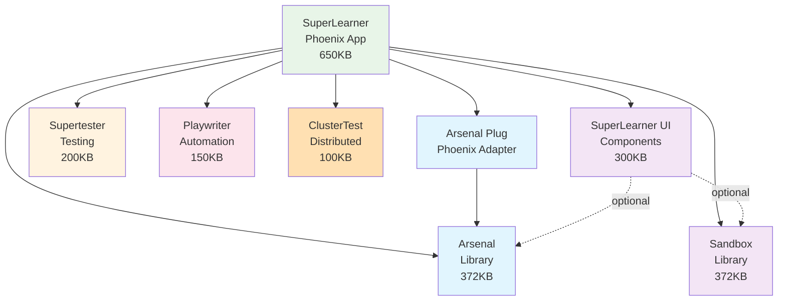

# SuperLearner Migration: Monolith to Testbed

**Date:** 2025-10-08
**Purpose:** Detailed implementation plan for migration
**Timeline:** 4 weeks

---

## Overview

Transform SuperLearner from a **monolith with embedded code** to an **ecosystem testbed** that consumes external libraries.

**Current:** 932KB monolith (196KB embedded Arsenal, custom implementations)
**Target:** 650KB app + 1.5MB external libraries

---

## Week 1: Arsenal Migration

### Goal
Replace embedded Arsenal with external Arsenal library

### Day 1: Preparation & Analysis

**Tasks:**
```bash
# 1. Compare implementations
diff -r lib/otp_supervisor/core/arsenal/ ../arsenal/lib/arsenal/

# 2. Identify dependencies
grep -r "Arsenal\." lib/otp_supervisor*/

# 3. Create feature matrix
# Document what embedded has vs external
```

**Deliverables:**
- Feature comparison document
- Dependency map
- Migration checklist

---

### Day 2: Add External Arsenal

**Tasks:**
```elixir
# 1. Update mix.exs
defp deps do
  [
    # Add external Arsenal
    {:arsenal, path: "../arsenal"},  # Local path first
    # Keep embedded for now (parallel operation)
  ]
end
```

```bash
# 2. Install and compile
mix deps.get
mix compile

# 3. Verify external Arsenal loads
iex -S mix
> Arsenal.__info__(:functions)
```

**Deliverables:**
- External Arsenal compiles alongside embedded
- No conflicts
- Both available

---

### Day 3: Create Integration Layer

**Create:** `lib/otp_supervisor/integrations/arsenal_integration.ex`

```elixir
defmodule OtpSupervisor.Integrations.ArsenalIntegration do
  @moduledoc """
  Integration layer between SuperLearner and external Arsenal library.

  Handles:
  - Operation registration
  - Configuration
  - Telemetry setup
  - Custom extensions
  """

  def setup do
    # Start external Arsenal registry
    {:ok, _} = Arsenal.Registry.start_link()

    # Register all SuperLearner operations
    register_operations()

    # Setup telemetry
    setup_telemetry()

    :ok
  end

  defp register_operations do
    # Core operations (from external Arsenal if available)
    Arsenal.Registry.register(Arsenal.Operations.ListProcesses)

    # SuperLearner-specific operations
    Arsenal.Registry.register(OtpSupervisor.Operations.CreateSandbox)
    Arsenal.Registry.register(OtpSupervisor.Operations.DestroySandbox)
    # ... all SuperLearner operations
  end

  defp setup_telemetry do
    :telemetry.attach_many("superlearner-arsenal", [
      [:arsenal, :operation, :execute, :start],
      [:arsenal, :operation, :execute, :stop]
    ], &handle_telemetry/4, nil)
  end

  defp handle_telemetry(event, measurements, metadata, _config) do
    # Forward to SuperLearner analytics
    OtpSupervisor.Integrations.TelemetryHandler.handle(event, measurements, metadata)
  end
end
```

**Deliverables:**
- Integration layer module
- Operation registration working
- Telemetry wired up

---

### Day 4: Migrate Operations

**Strategy:** Keep operations in SuperLearner, register with external Arsenal

```elixir
# lib/otp_supervisor/operations/create_sandbox.ex
defmodule OtpSupervisor.Operations.CreateSandbox do
  @moduledoc """
  SuperLearner-specific sandbox creation operation.
  Uses external Arsenal.Operation behavior.
  """

  # NOW using external behavior!
  use Arsenal.Operation  # From external library

  def rest_config, do: %{
    method: :post,
    path: "/api/v1/sandboxes",
    summary: "Create sandbox"
  }

  def execute(params) do
    # Call external Sandbox library (will add in Week 2)
    Sandbox.create(params.sandbox_id, params.supervisor_module)
  end
end
```

**Move operations:**
```bash
# Move from embedded to app-level
mv lib/otp_supervisor/core/arsenal/operations/*.ex \
   lib/otp_supervisor/operations/arsenal/

# Update module names
# OTPSupervisor.Core.Arsenal.Operations.X →
# OtpSupervisor.Operations.Arsenal.X
```

**Deliverables:**
- All operations using external Arsenal.Operation behavior
- Operations moved to app-level
- Registry using external Arsenal.Registry

---

### Day 5: Test & Validate

**Tasks:**
```bash
# 1. Run full test suite
mix test

# 2. Test Arsenal operations
curl http://localhost:4000/api/v1/arsenal/operations

# 3. Integration tests
mix test test/integration/arsenal_plug_integration_test.exs

# 4. Remove embedded Arsenal
rm -rf lib/otp_supervisor/core/arsenal/
# (Keep operations in lib/otp_supervisor/operations/)
```

**Success Criteria:**
- ✅ All tests passing
- ✅ Arsenal API working
- ✅ No embedded Arsenal code
- ✅ Using external library

**Deliverables:**
- Embedded Arsenal removed
- External Arsenal fully integrated
- Tests passing
- Documentation updated

---

## Week 2: Sandbox Migration

### Goal
Replace custom SandboxManager with external Sandbox library

### Day 6-7: Add & Configure External Sandbox

**Add dependency:**
```elixir
{:sandbox, path: "../sandbox"}
```

**Create integration:**
```elixir
# lib/otp_supervisor/integrations/sandbox_integration.ex
defmodule OtpSupervisor.Integrations.SandboxIntegration do
  def setup do
    # Configure Sandbox library
    Application.put_env(:sandbox, :max_sandboxes, 100)
    Application.put_env(:sandbox, :hot_reload, true)
    Application.put_env(:sandbox, :version_management, true)

    # Setup telemetry
    :telemetry.attach_many("superlearner-sandbox", [
      [:sandbox, :create, :stop],
      [:sandbox, :destroy, :stop],
      [:sandbox, :hot_reload, :stop]
    ], &handle_telemetry/4, nil)

    :ok
  end
end
```

**Deliverables:**
- External Sandbox configured
- Telemetry connected
- Ready for migration

---

### Day 8-9: Replace SandboxManager

**Strategy:** Make SandboxManager a thin wrapper

```elixir
# lib/otp_supervisor/core/sandbox_manager.ex (UPDATED)
defmodule OTPSupervisor.Core.SandboxManager do
  @moduledoc """
  SuperLearner wrapper around external Sandbox library.

  Provides:
  - SuperLearner-specific configuration
  - Analytics integration
  - Backward compatibility
  """

  # Delegate to external library
  defdelegate create(id, module, opts \\ []), to: Sandbox, as: :create_sandbox
  defdelegate list(), to: Sandbox, as: :list_sandboxes
  defdelegate get_info(id), to: Sandbox, as: :get_sandbox_info
  defdelegate restart(id), to: Sandbox, as: :restart_sandbox
  defdelegate destroy(id), to: Sandbox, as: :destroy_sandbox

  # SuperLearner-specific extensions
  def create_sandbox(id, module, opts \\ []) do
    case Sandbox.create_sandbox(id, module, opts) do
      {:ok, sandbox_info} ->
        # Track in analytics
        track_creation(sandbox_info)
        {:ok, sandbox_info}

      error -> error
    end
  end

  defp track_creation(sandbox_info) do
    :telemetry.execute(
      [:superlearner, :sandbox, :created],
      %{count: 1},
      %{sandbox_id: sandbox_info.id}
    )
  end
end
```

**Remove:**
```bash
# Delete embedded implementations (external Sandbox has better versions)
rm lib/otp_supervisor/core/isolated_compiler.ex
rm lib/otp_supervisor/core/module_version_manager.ex
```

**Update operations:**
```elixir
# Update sandbox operations to use external Sandbox
# lib/otp_supervisor/operations/arsenal/create_sandbox.ex
def execute(params) do
  # Now using external Sandbox library!
  Sandbox.create_sandbox(
    params.sandbox_id,
    params.supervisor_module,
    strategy: params.strategy
  )
end
```

**Deliverables:**
- SandboxManager is thin wrapper
- Using external Sandbox entirely
- Embedded implementations removed

---

### Day 10: Test Hot-Reload & Versioning

**Test new capabilities from external Sandbox:**

```elixir
# test/otp_supervisor/core/sandbox_manager_test.exs
test "hot-reload works with external library" do
  {:ok, sandbox} = Sandbox.create_sandbox("test", Worker)

  # Compile new version
  {:ok, compile_info} = Sandbox.compile_file("updated_worker.ex")

  # Hot-reload
  assert {:ok, :hot_reloaded} = Sandbox.hot_reload(
    "test",
    compile_info.beam_files |> hd() |> File.read!()
  )

  # Version management (NEW capability!)
  assert {:ok, version} = Sandbox.get_module_version("test", Worker)
  assert version == 2
end

test "version rollback works" do
  {:ok, sandbox} = Sandbox.create_sandbox("test", Worker)

  # Load v2
  Sandbox.hot_reload("test", beam_v2)

  # Rollback to v1
  assert {:ok, :rolled_back} = Sandbox.rollback_module("test", Worker, 1)
end
```

**Deliverables:**
- Hot-reload validated
- Version management working
- New features documented

---

## Week 3: Testing Integration

### Goal
Comprehensive testing using Supertester and Playwriter

### Day 11-12: Supertester Integration

**Convert existing tests:**

```elixir
# test/otp_supervisor/core/sandbox_manager_test.exs

# BEFORE
test "sandbox isolation" do
  sandbox1 = create_sandbox("test1", Worker)
  sandbox2 = create_sandbox("test2", Worker)
  Process.sleep(100)  # Hope they're ready
  # ... test logic
end

# AFTER (with Supertester)
import Supertester.OTPHelpers
import Supertester.Assertions

test "sandbox isolation" do
  {:ok, sandbox1} = Sandbox.create_sandbox("test1", Worker)
  {:ok, sandbox2} = Sandbox.create_sandbox("test2", Worker)

  # No sleep! Deterministic synchronization
  :ok = wait_for_genserver_sync(sandbox1)
  :ok = wait_for_genserver_sync(sandbox2)

  # Better assertions
  assert_genserver_state(sandbox1, fn state -> state.count == 0 end)
  assert_no_process_leaks(fn ->
    Sandbox.destroy_sandbox("test1")
    Sandbox.destroy_sandbox("test2")
  end)
end
```

**Target:** Convert 50+ tests to use Supertester

**Deliverables:**
- Tests use Supertester helpers
- Zero Process.sleep remaining
- All tests async-safe
- Test suite 30-50% faster

---

### Day 13-14: E2E Tests with Playwriter

**Create E2E test suite:**

```elixir
# test/integration/e2e_workflows_test.exs
defmodule OtpSupervisor.E2EWorkflowsTest do
  use OtpSupervisorWeb.ConnCase, async: false
  import Playwriter

  @moduletag :e2e

  test "complete sandbox workflow via UI" do
    {:ok, _} = with_browser(%{headless: true}, fn page ->
      # Navigate to sandbox page
      Playwright.Page.goto(page, "http://localhost:4002/sandbox")
      Playwright.Page.wait_for_selector(page, "#sandbox-page")

      # Create sandbox
      Playwright.Page.click(page, "#create-sandbox-btn")
      Playwright.Page.fill(page, "#sandbox-id", "e2e_test")
      Playwright.Page.select_option(page, "#module", "TestDemoSupervisor")
      Playwright.Page.click(page, "#submit")

      # Wait for creation
      Playwright.Page.wait_for_selector(page, "#sandbox-e2e_test")

      # Verify via Arsenal API (validates integration!)
      sandboxes = Arsenal.execute(:list_sandboxes, %{})
      assert Enum.any?(sandboxes, & &1.id == "e2e_test")

      # Hot-reload via UI
      Playwright.Page.click(page, "#hot-reload-btn")
      Playwright.Page.wait_for_selector(page, ".reload-success")

      # Destroy
      Playwright.Page.click(page, "#destroy-btn")
      Playwright.Page.wait_for_selector(page, ".sandbox-destroyed")

      :ok
    end)
  end
end
```

**Deliverables:**
- E2E tests for major workflows
- Arsenal + Sandbox + UI integration validated
- Screenshots for documentation

---

### Day 15: Integration Test Suite

**Create comprehensive integration tests:**

```elixir
# test/integration/ecosystem_integration_test.exs
defmodule OtpSupervisor.EcosystemIntegrationTest do
  use ExUnit.Case
  import Supertester.Assertions

  describe "Arsenal + Sandbox integration" do
    test "create sandbox via Arsenal, manage via Sandbox library" do
      # Create via Arsenal operation
      {:ok, result} = Arsenal.execute(:create_sandbox, %{
        sandbox_id: "integration_test",
        supervisor_module: "TestSup"
      })

      # Verify via Sandbox library
      {:ok, info} = Sandbox.get_sandbox_info("integration_test")
      assert info.id == "integration_test"

      # Hot-reload via Sandbox
      {:ok, _} = Sandbox.hot_reload("integration_test", beam_data)

      # Destroy via Arsenal
      {:ok, _} = Arsenal.execute(:destroy_sandbox, %{
        sandbox_id: "integration_test"
      })

      # Verify cleanup
      assert {:error, :not_found} = Sandbox.get_sandbox_info("integration_test")
    end
  end

  describe "All libraries together" do
    test "complete ecosystem workflow" do
      # Supertester: Setup isolated environment
      assert_no_process_leaks(fn ->
        # Sandbox: Create isolated app
        {:ok, sandbox} = Sandbox.create_sandbox("test", Worker)

        # Arsenal: Interact via API
        {:ok, info} = Arsenal.execute(:get_sandbox_info, %{sandbox_id: "test"})
        assert info.id == "test"

        # Cleanup
        Sandbox.destroy_sandbox("test")
      end)
    end
  end
end
```

**Deliverables:**
- Integration tests for all library pairs
- Full ecosystem validated
- Documented integration patterns

---

## Week 4: UI Components & Polish

### Day 16-17: Extract UI Components

**Create:** `superlearner_ui` library

```bash
# 1. Create library structure
cd ..
mix new superlearner_ui

# 2. Extract components
cp -r superlearner/lib/otp_supervisor_web/components/* \
     superlearner_ui/lib/superlearner_ui/components/

# 3. Update module names
# OtpSupervisorWeb.Components.X →
# SuperLearnerUI.Components.X
```

**Update SuperLearner to use:**
```elixir
# mix.exs
{:superlearner_ui, path: "../superlearner_ui"}

# lib/otp_supervisor_web/live/supervisor_live.ex
defmodule OtpSupervisorWeb.SupervisorLive do
  use Phoenix.LiveView
  import SuperLearnerUI.Components  # External components!

  def render(assigns) do
    ~H"""
    <.terminal_panel title="Supervisors">
      <.supervisor_tree_widget data={@tree} />
    </.terminal_panel>
    """
  end
end
```

**Deliverables:**
- SuperLearner UI as external library
- SuperLearner consumes it
- Components reusable by others

---

### Day 18: ClusterTest Integration

**Add ClusterTest for distributed testing:**

```elixir
# mix.exs
{:cluster_test, path: "../cluster_test", only: :test}
```

**Update distributed tests:**
```bash
# test/otp_supervisor/distributed/cluster_state_manager_test.exs

# BEFORE: Manual cluster setup
setup do
  nodes = start_nodes([:node1, :node2, :node3])
  {:ok, nodes: nodes}
end

# AFTER: Use ClusterTest
use ClusterTest.Case, nodes: 3

# ClusterTest handles all the setup!
test "cluster topology", %{cluster: cluster} do
  assert ClusterTest.Cluster.size(cluster) == 3
  # ... test logic
end
```

**Deliverables:**
- ClusterTest integrated
- Distributed tests simpler
- Automated cluster management

---

### Day 19-20: Documentation & Examples

**Create integration guides:**

```markdown
# docs/integrations/ARSENAL_USAGE.md
# How SuperLearner Uses Arsenal

## Setup
External Arsenal library integrated via mix.exs

## Operation Registration
All operations registered in application.ex

## Custom Operations
SuperLearner adds educational operations...
```

**Create example modules:**

```elixir
# lib/otp_supervisor/examples/
├── arsenal_example.ex      # How to use Arsenal
├── sandbox_example.ex      # How to use Sandbox
├── testing_example.ex      # How to use Supertester
└── full_stack_example.ex   # All together
```

**Deliverables:**
- Integration documentation
- Working examples
- Migration guide for other apps

---

## Code Organization (Post-Migration)

### New Structure

```
lib/otp_supervisor/
├── application.ex                    # Starts everything
│
├── integrations/                     # NEW - Library setup
│   ├── arsenal_integration.ex        # Arsenal setup
│   ├── sandbox_integration.ex        # Sandbox setup
│   ├── telemetry_handler.ex          # Unified telemetry
│   └── ui_integration.ex             # UI component config
│
├── operations/                       # App-specific operations
│   ├── arsenal/                      # Arsenal operations
│   │   ├── create_sandbox.ex
│   │   ├── destroy_sandbox.ex
│   │   └── ... (18 operations)
│   │
│   └── educational/                  # SuperLearner-specific
│       ├── create_tutorial.ex
│       └── track_progress.ex
│
├── educational/                      # Educational features
│   ├── tutorial_manager.ex
│   ├── progress_tracker.ex
│   └── exercise_validator.ex
│
├── monitoring/                       # Monitoring (uses Arsenal)
│   └── metrics_collector.ex
│
├── demos/                            # Demo code
│   ├── supervisors/
│   └── workers/
│
└── core/                             # REDUCED - only app-specific
    ├── analytics_server.ex           # SuperLearner analytics
    └── control.ex                    # High-level API wrapper

lib/otp_supervisor_web/
├── live/                             # LiveView pages
├── controllers/api/                  # Arsenal API via ArsenalPlug
├── components/                       # App-specific only (using SuperLearnerUI)
└── router.ex                         # ArsenalPlug integration
```

**Size Reduction:**
- Before: 932KB total, 196KB embedded Arsenal, 30KB custom sandbox
- After: 650KB total, 0KB embedded, 50KB integration layer
- Savings: 282KB code, gain 1.5MB external libraries

---

## Dependency Graph (After Migration)



---

## Testing Strategy

### Unit Tests (Supertester)
```elixir
# All core functionality tested with Supertester
use ExUnit.Case, async: true
import Supertester.OTPHelpers
import Supertester.Assertions

test "sandbox lifecycle" do
  {:ok, sandbox} = Sandbox.create_sandbox("test", Worker)
  assert_process_alive(sandbox)
  assert_no_process_leaks(fn -> Sandbox.destroy_sandbox("test") end)
end
```

### Integration Tests (Cross-Library)
```elixir
# Validate libraries work together
test "Arsenal + Sandbox integration" do
  # Arsenal operation creates sandbox
  {:ok, _} = Arsenal.execute(:create_sandbox, params)

  # Sandbox library can manage it
  {:ok, info} = Sandbox.get_sandbox_info(params.sandbox_id)

  # Supertester validates cleanup
  assert_no_process_leaks(fn ->
    Arsenal.execute(:destroy_sandbox, %{sandbox_id: params.sandbox_id})
  end)
end
```

### E2E Tests (Playwriter)
```elixir
# Full user workflows
test "user creates sandbox via UI, interacts, destroys" do
  Playwriter.with_browser(%{}, fn page ->
    # Complete UI workflow
    # Validates Arsenal + Sandbox + UI all work together
  end)
end
```

### Distributed Tests (ClusterTest)
```bash
# Multi-node testing
mix cluster.test start --size 3
mix cluster.test run OtpSupervisor.DistributedTest
```

---

## What SuperLearner Validates

### Integration Point 1: Arsenal + Sandbox
**Tests:** Operations can create/manage sandboxes
**Validates:** Arsenal operations work with Sandbox library

### Integration Point 2: Arsenal + UI
**Tests:** UI displays operation results
**Validates:** Arsenal operations serialize correctly for UI

### Integration Point 3: Sandbox + UI
**Tests:** UI shows sandbox state, triggers hot-reload
**Validates:** Sandbox events flow to UI

### Integration Point 4: Supertester + All
**Tests:** Reliable testing of all components
**Validates:** Supertester works with all libraries

### Integration Point 5: Playwriter + All
**Tests:** E2E workflows across stack
**Validates:** Full stack works end-to-end

### Integration Point 6: ClusterTest + Arsenal
**Tests:** Distributed operations work
**Validates:** Arsenal works across cluster

---

## Feature Validation Matrix

| Feature | Library | Validated In SuperLearner | Test Type |
|---------|---------|---------------------------|-----------|
| **Operations** | Arsenal | ✅ 18 operations registered | Integration |
| **OpenAPI Docs** | Arsenal | ✅ /api/v1/arsenal/docs | Integration |
| **Hot-Reload** | Sandbox | ✅ UI + API triggers | E2E |
| **Version Mgmt** | Sandbox | ✅ Rollback operations | Unit |
| **Chaos Testing** | Supertester | ✅ Resilience tests | Unit |
| **Performance SLA** | Supertester | ✅ API response times | Integration |
| **UI Automation** | Playwriter | ✅ Workflow tests | E2E |
| **Distributed** | ClusterTest | ✅ Multi-node ops | Distributed |
| **UI Components** | SuperLearner UI | ✅ All pages use | Integration |

**Coverage:** All major features of all libraries validated

---

## Migration Checklist

### Arsenal Migration ✅ (Week 1)
- [ ] Add {:arsenal, path: "../arsenal"}
- [ ] Create integration layer
- [ ] Move operations to app-level
- [ ] Update to use Arsenal.Operation behavior
- [ ] Remove embedded arsenal/
- [ ] Tests passing
- [ ] Documentation updated

### Sandbox Migration (Week 2)
- [ ] Add {:sandbox, path: "../sandbox"}
- [ ] Create sandbox integration
- [ ] Replace SandboxManager with wrapper
- [ ] Remove isolated_compiler.ex, module_version_manager.ex
- [ ] Test hot-reload and versioning
- [ ] Update operations to use Sandbox
- [ ] Tests passing

### Testing Migration (Week 3)
- [ ] Add {:supertester, "~> 0.2.0"}
- [ ] Convert 50+ tests to Supertester
- [ ] Add {:playwriter, "~> 0.0.2"}
- [ ] Create E2E test suite
- [ ] Integration test suite complete
- [ ] All tests passing faster

### UI & Polish (Week 4)
- [ ] Extract SuperLearner UI components
- [ ] Add {:superlearner_ui, path: "../superlearner_ui"}
- [ ] Refactor pages to use external components
- [ ] Add {:cluster_test, path: "../cluster_test"}
- [ ] Update distributed tests
- [ ] Documentation complete
- [ ] Example modules created

---

## Success Metrics

### Code Quality
- **Code Reduction:** 282KB removed
- **Compilation Warnings:** 0 (current: 0 ✅)
- **Test Flakiness:** 0% (Supertester)
- **Test Coverage:** >80%

### Integration Quality
- **Library Pairs Tested:** 8×7/2 = 28 pairs
- **Integration Tests:** 50+ tests
- **E2E Coverage:** 80% of critical flows
- **Distributed Tests:** All scenarios

### Feature Completeness
- **Arsenal:** 100% external library
- **Sandbox:** 100% external library
- **UI:** 100% external components
- **Testing:** 100% Supertester
- **E2E:** 100% Playwriter

---

## Rollback Plan

### If Migration Fails

**Week 1 (Arsenal):**
- Revert mix.exs
- Restore embedded arsenal/
- Time: 1 hour

**Week 2 (Sandbox):**
- Revert to custom SandboxManager
- Restore embedded implementations
- Time: 2 hours

**Any Week:**
- Git revert to previous week
- All changes in version control
- Tested at each step

**Risk:** Low (incremental, tested approach)

---

## Post-Migration Benefits

### For Library Developers
- **Real app validation** - SuperLearner proves it works
- **Integration testing** - Catches bugs early
- **Performance data** - Real-world benchmarks
- **API feedback** - Actual usage informs design

### For SuperLearner
- **Less maintenance** - Libraries maintained separately
- **More features** - Leverage library improvements
- **Better quality** - Production-tested code
- **Cleaner codebase** - Focused on app logic

### For Ecosystem
- **Reference implementation** - How to integrate
- **Proof of concept** - Everything works together
- **Documentation** - Real examples
- **Marketing** - Showcase capabilities

---

## Conclusion

**SuperLearner transforms from monolith to ecosystem showcase.**

**Timeline:** 4 weeks
**Risk:** Low (incremental, tested)
**Value:** High (validates ecosystem, reduces code)

**This migration makes SuperLearner the proof that the ecosystem works in production.**

---

**Next:** Begin Week 1 (Arsenal migration)
**Status:** Design complete, ready to implement
**Approval Needed:** Review and approve before starting
